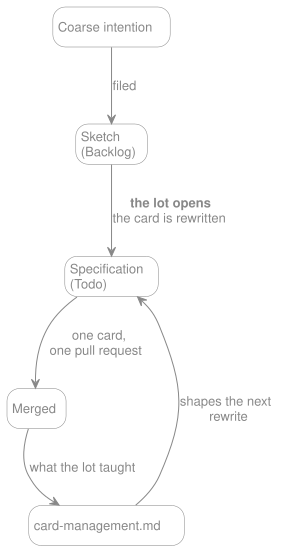

# Card Management

> **In brief**
>
> - A card is a change that can merge into `main` on its own and leave it stable, tested and documented.
> - Cards are cut when their lot opens: a `Backlog` card is a sketch, a `Todo` card is a specification, and moving one
>   between them is the rewrite rather than a drag.
> - Size is a target, not a measurement: a pull request somebody reviews in one sitting. Under roughly four files, ask
>   whether it is a card at all; past roughly four hundred added lines, ask what else got in.
> - Three tests, in the order they catch things: does it cost more to file than to do, does its title need "and", does
>   its body carry its own open decisions.
> - Adjacent work found while a card is open is done inside it, in its own commit, not filed as a card of its own. Clean
>   scope protects the reviewer, so the split is decided once, when the pull request opens.
> - A card is a hypothesis. If its title is still true the scope simply grew; if it is not, the card is rewritten. The
>   divergence is written in the pull request, and only when the original plan was wrong.
> - The template is the [issue form](https://github.com/Gcob/lara-spec-first/blob/main/.github/ISSUE_TEMPLATE/task.md).
>   This file is where its reasoning lives.
> - `Status` moves with the work; `Phase` and `Kind` are set at triage and `Lot` when that lot is cut. The board holds
>   all four, and a card's body carries one only until it gets there.

Three lots have been cut so far, and each one needed a review to find the same two failures: a card small enough to be a
checkbox on another one, and a card large enough to be a lot. This file exists so that the next lot does not pay for
that review again.

## A card is a vertical slice

**A card is a change that can merge into `main` on its own and leave it stable, tested and documented.** That is the
whole definition, and everything below follows from it.

It is never "the emitter", then "its tests", then "its documentation". The
[three-places rule](../../AGENTS.md#every-change-lands-in-three-places) already forbids splitting those apart, so a card
that proposes it is asking for permission to ship something incomplete. When a change is genuinely too large, split it
the other way: the happy path first and the edge cases second, or one command flag at a time. Both leave each half
shippable.

## Cards are cut when the lot opens, not before

**A lot exists as a coarse intention from the day the phase is planned. The cards inside it are written just before that
lot opens.** This file leans on the rule twice already, once to defer
[#40](https://github.com/Gcob/lara-spec-first/issues/40)'s split and once to explain a card with no `Lot`, so it is
worth stating as a rule rather than leaving as an excuse.

The reason is that a card written six months early is written against a tree, a design and a set of decisions that have
all moved by the time somebody picks it up. Lot 0 paid for that in full: its cards were written in one sitting before
any of the work was understood, and every one of them had to be reworded mid-flight, not because the work changed but
because the card had guessed at how the work would be described.

**Which is what the `Status` column actually says: how settled a card is, not only where it sits.** A `Backlog` card is
a sketch. It records that something is coming and roughly what, and reading it as though it were settled is the mistake
this rule prevents. A `Todo` card is a specification: its lot has been cut, so it was rewritten against the tree as it
stands now.

**Moving a card from `Backlog` to `Todo` is that rewrite, not a drag between columns.** A sketch promoted without being
rewritten is a specification nobody wrote, and it gets discovered mid-flight, which is exactly what Lot 0 cost. Deleting
a sketch is the opposite overreaction: the coarse intention is worth keeping.
[#40](https://github.com/Gcob/lara-spec-first/issues/40) is the standing example, known to be a lot rather than a card,
and split when Lot 2 opens rather than today.

**A finished lot owes one thing to the next: what it taught, written down where the next lot will read it.** That place
is [What we have actually got wrong](#what-we-have-actually-got-wrong) on this page, named with the card that produced
the lesson. A lesson nobody wrote down is a feeling, and the next lot repeats it.

## Size is a target, not a measurement

**This repository's own history cannot be the calibration, and it is worth saying why out loud.** Phase 1 was written in
very large pull requests: #12 changed 73 files and added 5,984 lines, #5 added 5,067, #16 added 4,174. Averaging that
would enshrine exactly the habit this file exists to stop. The Lot 0 cards are the opposite sample and no more usable
alone: four documentation changes, 4 to 31 files, 113 to 362 added lines. Both are ditches, not a road.

So the target is chosen rather than computed:

- **A pull request somebody reviews in one sitting, without a pause.** That is the real constraint. Everything below is
  a proxy for it.
- **Under roughly four files touched, ask whether it is a card at all.** It is usually a line in another card's
  `Done when`.
- **Past roughly four hundred added lines, ask what else got in.** Not a refusal, a question. The answer is usually a
  second card.

**No measured range is published here as a norm.** [`documentation.md`](./documentation.md) already refuses a number in
prose that an unrelated change can falsify, and a bracket computed from merged pull requests is precisely that: it moves
on its own, and it would be wrong the week somebody lands one large refactor.

## The three tests, in the order they catch things

**Does the card cost more to file than to do?** Then it is a line in another card's `Done when`.

**Does its title need "and"?** Then each verb is probably its own card.

**Does its body carry its own open decisions?** Then it is a lot, not a card. This is the one generic advice misses, and
the one this repository keeps hitting. A card whose `Done when` cannot be verified until somebody first decides
something is two pieces of work wearing one number.

### An interview is one way to run the third test

The third test is the hard one, because a body full of open decisions reads like a plan until somebody tries to verify
it. One way to find them before writing the card is to be questioned about it: an agent that interrogates a design round
by round surfaces the decisions nobody had noticed were still open, which is the same output the test is looking for.

[AIHero](https://www.aihero.dev/) publishes skills that do this, `grill-with-docs` for something settleable in one
session and `wayfinder` for a lot being cut. **Those two names are search terms rather than links**, since the pages
documenting them move and a dead link here would be worse than a name somebody can look up. They are named here because
they exist and they fit, not because anything depends on them: nothing in this repository invokes them, no command
checks for them, and a card cut without one is not worse for it. **What does not carry over is their paper trail.** They
write a `CONTEXT.md` glossary and ADRs under `docs/adr/`, and this project already answers both questions elsewhere, in
[`documentation.md`](./documentation.md#document-inventory) and in the `Open` rows of [`stack.md`](../project/stack.md).
Taking the interview and leaving the filing is the way to use them here.

## Work that overflows a card is done inside it

**A card is cut before the work starts, which means it is cut from outside the code.** It will be wrong sometimes, and
the two ways it goes wrong are worth separating, because they have different answers.

The first is adjacent work. Something small, obvious and clearly worth doing turns up while the card is open, and the
reflex is to file it. **Do it instead.** Filing costs the writing, the rereading months later, the reload of a context
that is loaded right now, a branch and a pull request, all to protect work that takes minutes. The context that makes
the fix cheap is the thing the card would throw away.

**Clean scope protects the reviewer, not the person writing the code.** That is the whole reason the rule can be this
loose: the constraint this file already publishes,
[a pull request somebody reviews in one sitting](#size-is-a-target-not-a-measurement), starts applying the moment a
reviewer exists. So it is enforced where it bites,
[when the pull request is opened](#the-split-is-decided-once-when-the-pull-request-opens), and nothing about it has to
be decided while the work is moving.

**The separate commit is what makes that possible, and it is the only thing asked during the work.** It costs nothing,
it does not interrupt anything, and it keeps the overflow extractable: work buried inside a larger commit cannot be
split out later, so the decision at the end stops existing. A commit that says `chore:` or `refactor:` on a `feature/`
branch is already saying it is not the card, which is why no new marker is introduced here. The
[Conventional Commit type](../../CONTRIBUTING.md#commit-messages) carries it, and a parallel vocabulary would drift from
the one that already works.

### When it stops being overflow

Three questions, and they are questions rather than limits. Each one has a clear answer in the moment and no useful
answer in the abstract, which is why none of them is a count.

**Does it finish in this session?** The line is not small against large, it is **finished against started**. Started
work asleep in a branch costs more than the card it was avoiding, because the context that justified skipping the card
is gone by the time anybody looks at it again.

**Does it need a decision you would not make alone?** A design, a public API, a breaking change. This is
[the third test](#the-three-tests-in-the-order-they-catch-things) arriving mid-flight rather than at triage: work
carrying its own open decisions is a lot, and noticing it late does not make it less of one.

**Does it touch a migration or the published contract?** Those carry a review cost that unplanned work does not pay, and
the compatibility surface is a contract the moment the package is published.

**Nothing here is a quota.** An overflow that keeps growing is not caught by counting it, it is caught by one of the
three questions above finally answering yes, and by the pull request getting harder to describe in a sentence. The
person doing the work is the one who can see that, and this file gives them the questions rather than a number to obey.

**Overflow that is not done is deferred work, and that rule already exists.** When the answer to any of the three
questions is yes and the card it belongs to is not open yet, what you leave behind is a marker carrying a card number,
at the line where a future reader needs it. The notation, the rule and the limit that keeps markers from becoming noise
are all in [`CONTRIBUTING.md`](../../CONTRIBUTING.md#deferred-work-leaves-a-marker), which is where they live because
`just check-markers` reads this file and would flag the notation written out here as a marker of its own. **Whether the
marker is worth leaving at all is answered there too**: only where the code is where somebody would need to know, since
a marker that repeats what the card already says is noise.

## The split is decided once, when the pull request opens

**Read the branch's `git log` and decide there, not earlier.** By then the work is done, the overflow is visible, and
the reviewer the split protects finally exists. This is the same reason cards are
[cut when their lot opens](#cards-are-cut-when-the-lot-opens-not-before): the decision is cheaper and better once the
information exists.

A commit belongs in a pull request of its own when one of these is true.

- **It touches a different area than the card.** A different reviewer would be the right one, and bundling it means
  neither of them reviews their own half properly.
- **It has to be revertable on its own.** The risk profile is not the card's, so it should not share the card's fate.
- **It is larger than the card it grew out of.** That one is a diagnosis rather than a rule: it says the triage was
  wrong, and the split is the smaller half of what to do about it.

Otherwise it stays in the same pull request and the description says so. A reviewer reading "commits 3 and 4 also fix X,
which the change needed" is better served than one who finds them unannounced.

**Stacking pull requests on one another is available and is not required.** It is worth knowing about, because it is
what makes the first case above cost little: branch the second pull request on the first rather than on `main`, and each
stays reviewable on its own. Whether the bookkeeping is worth it on a given change is the author's call, and on most
changes it is not.

## A card whose scope grew, and a card whose goal changed

**A card is a hypothesis, not a contract.** It was written against the tree and the understanding available before
anybody opened the code, and finding out that it was wrong is the work succeeding, not the work going astray. This file
already says as much about a `Backlog` sketch; the same holds for a `Todo` card once the work starts.

The question that separates the two cases is whether **the title is still true**.

- **It is.** The goal holds and the scope grew under it. Adjust the body and carry on. Nothing else happens, and nothing
  about the board changes.
- **It is not.** The card now tells two stories. Rewrite it whole, or close it and open one that says what the work
  actually is.

**The failure to avoid is the hybrid**: a card that keeps its original title and accumulates a second goal underneath.
It reads as settled, it is not, and nobody can tell three months later which half the number refers to. Rewriting a card
is already the ordinary move here, since
[promoting a sketch to a specification](#cards-are-cut-when-the-lot-opens-not-before) is a rewrite rather than a drag,
so this asks for nothing the project does not already do.

### Where the divergence gets written

**In the pull request description, and only when there was one.**

Not in the card: the card would be a third copy of what the commits and the description already carry, and three copies
drift. Not in the template either, for the reason
[`Out of scope` was declined](#what-this-project-deliberately-does-not-use): a section that is always present is filled
with "none" or with a restatement of the diff, and a template nobody completes stops being read. The card gets one line
when it closes, not a running log.

**What earns the space is why the original plan was wrong**, not a list of what else got done. The diff already carries
the list.

> The card assumed the resolver handled nested `$ref`. It did not, so commits 3 and 4 rework it, which is where the size
> of this pull request comes from.

That is worth reading. "Also touched the resolver, fixed two typos and added a test" is not: it is the diff, retyped.

**And it compounds.** Written down consistently, the reasons the plan was wrong are the one record nobody keeps and
everybody needs: where this project's estimates break. A run of them says more about what to watch for in the next lot
than any estimate would have.

## What we have actually got wrong

Named with the cards that produced them, so that the lesson is checkable rather than asserted.

**A card that says it "lands in the same change" as another one is a checkbox on that other one.**
[#37](https://github.com/Gcob/lara-spec-first/issues/37) said exactly that in its own `Ready when`, and was folded into
[#34](https://github.com/Gcob/lara-spec-first/issues/34). The three-places rule had already made it impossible for #34
to ship without it.

**A card that carries a decision, a reusable mechanism and an emitter at once is a lot.**
[#40](https://github.com/Gcob/lara-spec-first/issues/40) carries the `overrides.scan` naming and recursion decision, the
`extends`-based override discovery, and the factory emitter. Its split happens when Lot 2 opens rather than now: it
blocks nothing today, and rewriting a card before its lot is cut is the same guessing this file exists to stop.

**A card whose `Done when` names a file instead of a result cannot be verified by anybody who did not write it.**
[#70](https://github.com/Gcob/lara-spec-first/issues/70) wrote
`scripts/check-open-questions.mjs, with two halves that fail differently`; the file was renamed to `check-markers.mjs`
while the card was open, and the box had to be reworded before it could be ticked rather than simply ticked. The work
had not changed. Lot 1 was written the other way round, because of what that cost:
`generated.namespace is read, and its config block moves from STARTED to DONE` survives any rename, since it describes
what is true rather than what is called what.

## The template, and what each kind of card drops

**The template lives in the
[issue form](https://github.com/Gcob/lara-spec-first/blob/main/.github/ISSUE_TEMPLATE/task.md)**, which is what GitHub
offers when somebody opens an issue. This file carries its reasoning; the form carries its shape. When the two disagree,
the form is what people actually fill in, so fix the form first and then say why here.

Four sections, of which two are usually absent:

| Section      | Carries                                                        | Dropped by                   |
| ------------ | -------------------------------------------------------------- | ---------------------------- |
| `Why`        | Two sentences: the problem, not the solution                   | Nobody                       |
| `Ready when` | Card numbers that have to land first, and nothing else         | Any card that nothing blocks |
| `Acceptance` | One to three Gherkin scenarios                                 | Every card but a `Feature`   |
| `Done when`  | Only the delta on top of the three places and `composer check` | Nobody                       |

So a `Docs` card with no blocker is two sections, a `Chore` card is rarely more, and only a `Feature` card routinely
carries all four.

**A card carries only the delta.** Repeating the general definition of done on thirty cards is how it stops being read.
`Ready when` replaces a ceremonial definition of ready: it holds card numbers, and it is deleted outright rather than
left empty. **A `Decision` card is done when the document stops saying `Open`**, not when somebody has made up their
mind, which is the same rule [`stack.md`](../project/stack.md) applies to its own Status column.

## A card cites a file as a permalink

**A card cites a file or a line as a permalink pinned to a commit, never as a bare path.** The
[issue form](https://github.com/Gcob/lara-spec-first/blob/main/.github/ISSUE_TEMPLATE/task.md) says so and this is why:
a card is written against the tree as it stands today and started against the tree as it stands in six months.
`security.md:186` is a promise that the line has not moved, and nothing keeps that promise. A permalink names the
commit, so it answers the same question forever, and it answers the one that actually matters, which is what we were
looking at when we wrote the card rather than what is there now.

The same rule is why a card names the deferred-work marker it settles rather than describing it: the marker carries the
card number, [`CONTRIBUTING.md`](../../CONTRIBUTING.md#deferred-work-leaves-a-marker) carries the rule, and
`just check-markers` fails when the two drift apart.

The shape came out of a planning note that git does not track, so there is no link to follow and none is needed: what
survived that argument is on this page.

## The board

One project board, at [projects/1](https://github.com/users/Gcob/projects/1). Four fields carry meaning.

| Field    | Values                                                                    | Who moves it                           |
| -------- | ------------------------------------------------------------------------- | -------------------------------------- |
| `Status` | `Backlog`, `Todo`, `In Progress`, `In review`, `Ready to publish`, `Done` | Whoever is doing the work, as it moves |
| `Phase`  | `Phase 1`, `Phase 2`, `Phase 3`, `Gate 0.x`, `Gate 1.0`, `BC enforcement` | Set at triage, rarely after            |
| `Lot`    | `Lot 0` through `Lot 7`                                                   | Set when the lot is cut, rarely after  |
| `Kind`   | `Feature`, `Docs`, `Decision`, `Chore`                                    | Set at triage, rarely after            |

`Status` is the only field that moves often, and what each value claims about a card is
[above](#cards-are-cut-when-the-lot-opens-not-before): `Backlog` is a sketch, `Todo` is a specification. The one a
newcomer cannot guess is `Ready to publish`, which is work already merged and waiting on a release rather than on a
reviewer, and that is what separates it from `In review`.

**A card can legitimately carry no `Phase` either.** [#68](https://github.com/Gcob/lara-spec-first/issues/68), which
asks how ownership gets declared in the contract, is a positioning question rather than a feature, and forcing it into a
phase would claim a sequencing nobody has decided. One card in that state is a fact about the question; several would
mean triage has stopped happening.

**A card with no `Lot` is one no lot has cut yet.** That is every card past the current phase, plus the gates and the
breaking-change set, which belong to no lot by design. It is a normal state, not a gap to fill: a card gets its `Lot`
when somebody decides the lot, and guessing earlier is the same guessing this file exists to stop.

**`Kind` decides what a card is made of, which is why it is a field rather than a note.** The
[template above](#the-template-and-what-each-kind-of-card-drops) drops `Acceptance` on every card but a `Feature`, and
[`CONTRIBUTING.md`](../../CONTRIBUTING.md#branch-names) branches a `Decision` card as `docs/` because what it delivers
is the document that stops saying `Open`. `Chore` is the one carrying no rule of its own: maintenance that is neither a
feature nor a document, which takes whatever sections the work actually needs.

**A field lives on the board, and a card's body carries it only until it gets there.** The
[issue form](https://github.com/Gcob/lara-spec-first/blob/main/.github/ISSUE_TEMPLATE/task.md) cannot set a project
field, because the item does not exist while somebody is filling the form in, so it asks for the lot and the kind as
plain lines and triage moves them onto the board. From that moment the field is the answer and the line is stale text
rather than a second source.

**Which makes a body line that disagrees with its field nothing to reconcile.** It is deleted the next time the card is
rewritten, and going hunting for it across sketches no lot has cut yet would be the same guessing
[this file exists to stop](#cards-are-cut-when-the-lot-opens-not-before).

**The `decision` label is not decoration.** A card that settles a question a document marks `Open` carries it, and
`just check-markers --online` requires every open card carrying it to be named by at least one marker. The rule and its
consequence are in [`CONTRIBUTING.md`](../../CONTRIBUTING.md#deferred-work-leaves-a-marker).

## What this project deliberately does not use

**No epics, and no card broken into GitHub sub-issues.** `Phase` and `Lot` already group cards, and a second grouping
mechanism drifts from the first. The board's `Parent issue` and `Sub-issues progress` fields stay unused, named here
because their presence otherwise reads as an invitation.

This is not a rule about checkboxes. A markdown `- [ ]` inside `Ready when` or `Done when` is the normal way a card
lists what it owes. What is refused is promoting those lines into cards of their own.

**No estimate in hours or days.** It means nothing for a repository worked on largely by agents, and the size target
above answers the question an estimate was being asked to answer.

**No `Out of scope` section in the template.** It was considered and declined: it overlaps `Ready when` and the
[one-topic-one-file](./documentation.md#one-topic-one-file) rule, it would be filled on maybe three cards in ten, and a
fifth section nobody completes is how a template turns back into the wall of text it replaced. When a boundary genuinely
needs stating, it is a sentence in `Why`, where it reads as reasoning rather than as paperwork.

## Every link has to survive a clone

`planning/` and `reviews/` are in `.gitignore`, and `srcExclude` in `.vitepress/config.mts` drops `planning/**`,
`reviews/**`, `tests/**` and `.github/**` from the site. A relative link into any of them is a dead link in
`docs:build`, which is how `main` went red once already.

- **Tracked but unpublished**, such as the issue form under `.github/`: use an absolute `https://github.com/` URL, the
  way the [inventory](./documentation.md#document-inventory) already points at `LICENSE`.
- **Not tracked at all**, such as a planning note: there is no link to write. Cite the public card instead, which is
  permanent and is where the work lands anyway.
