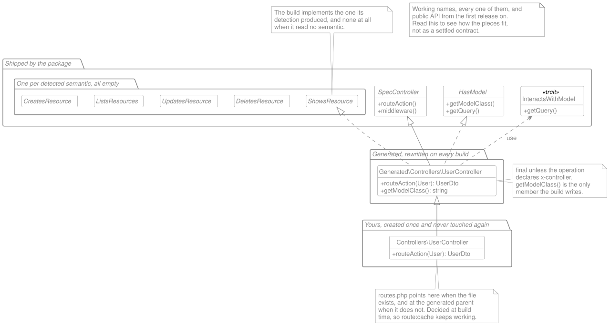
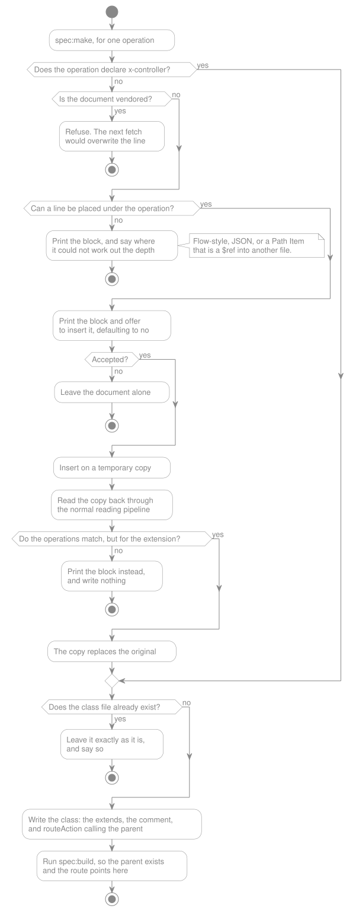
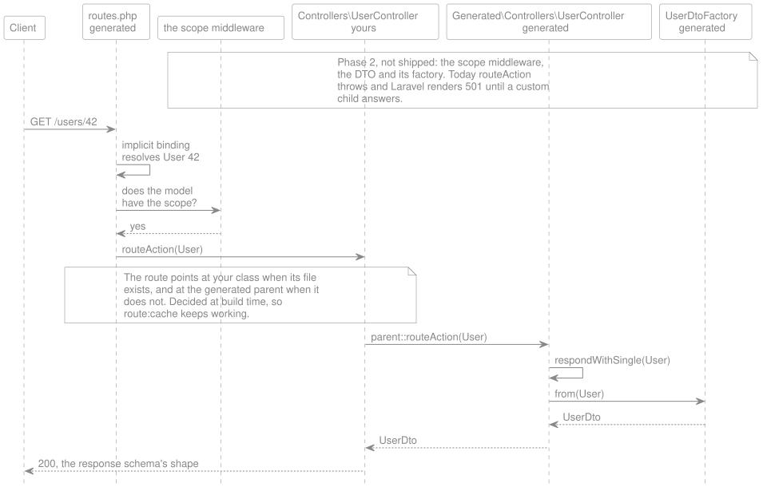

# Controllers

> **TL;DR**
>
> - One controller per operation, carrying one method named `routeAction`.
> - `x-controller` is the whole customization model: it names the class you will own, and the generated parent drops its
>   `final`.
> - An operation that declares no `x-controller` gets a `final` controller, which nothing can extend.
> - `spec:make` is the only command that creates a file you will own. The build never scaffolds, it names the command.
> - **Not built yet:** `x-model` and everything model-shaped, which is Phase 2.

An operation needs something to answer it. This document owns what that something is: how many files it takes, what it
assumes about your application, and where a developer's own code attaches to it.

> **Partly shipped, and this document spans two phases.** `spec:build` emits one controller per operation, each carrying
> one `routeAction` over the shipped `SpecController` base with its `middleware()` method, and answering
> [501](./code-generation/scaffolding.md#an-unimplemented-operation-answers-501). **The two-class seam is shipped
> whole:** `x-controller` is read, a declared controller names the generated parent and drops its `final`, the route
> points at the child once that class exists, and two values reducing to one parent is a build error naming both.
> **`spec:make` ships whole**: its three forms, the insertion prompt below with the edit verified on a copy, and the
> build it runs afterwards. Nothing in [Phase 1](../project/roadmap.md#phase-1-the-foundation) is left in this document.
> [Phase 2](../project/roadmap.md#phase-2-the-generated-pipeline-mocks-and-the-driver-features) carries everything
> model-shaped: `x-model`, the CRUD defaults, `HasModel` and its trait, the marker interfaces, the DTO factory calls,
> the pagination seams and the mass-assignment check, because a generated CRUD body has nothing to return until the DTOs
> exist. Items marked `Open` are undecided.

## One controller per operation, one method named `routeAction`

**Decision: every operation gets its own generated controller, carrying exactly one route method, always named
`routeAction`.** Not a resource controller holding several operations, and not an invokable class.

**One fixed method name rather than one derived from the operation**, and the reasoning is predictability: every
controller this package generates has `routeAction`, so "which method do I override" has one answer, forever, with no
naming convention to learn and no derived spelling to reconstruct. The
[operation's identity](./glossary.md#operations-identity) is carried by the class name and stated exactly in
[the file's own docblock](./code-generation/generated-file-anatomy.md#every-generated-file-explains-itself), which is
where a reader looks anyway.

Two alternatives were considered and dropped:

- **Grouping several operations into one controller.** A controller generated with five abstract methods needs a
  concrete subclass implementing all five before PHP will instantiate it — you cannot ship three today and two tomorrow.
  One operation per class removes the problem entirely rather than managing it. Grouping is also what `x-controller` was
  first considered for; [it does something else here](#the-specification-decides-what-is-customizable), and nothing in
  this package produces a shared file.
- **An invokable.** `routeAction` appears in the generated route registration, in stack traces, in IDE navigation, and
  in a grep for every spec-driven action at once. `__invoke` appears in none of them: it is a magic method whose name
  says nothing about what it does, and the route registration degrades from an explicit
  `[Controller::class, 'routeAction']` pair to a bare class string.

### The signature is the contract with the child

**Decision: `routeAction` declares one parameter per path parameter, `string`, named the way the specification names
it.** `GET /users/{id}` generates `routeAction(string $id): mixed`.

**PHP is what makes this a decision rather than a detail.** An override may not add a required parameter, so a parent
declaring none would forbid every custom controller from ever seeing `{id}` — a developer could only reach it through
the request object, which is the opposite of what a generated seam is for. It was found in the Workbench rather than by
reasoning: a child declaring `routeAction(string $id)` over a parameterless parent is a fatal error at load.

**Named, because Laravel matches route parameters to method parameters by name** rather than by position. That makes the
specification's spelling load-bearing here in a way it is not elsewhere — renaming `{id}` to `{userId}` changes this
signature, and a child overriding it has to follow. Identity is
[still normalized](./code-generation/generated-file-anatomy.md#identity-is-the-path-and-the-method-not-the-name),
because that question is asked for rename detection rather than for signatures, and the two must not be conflated.

**`string` until something says otherwise.** A route parameter is text on the wire; `x-model` is what will turn one into
a bound model, and the parent will declare that type when it does. A child may narrow the return type — `array` where
the parent says `mixed` — but not the parameters, which is ordinary PHP variance rather than a rule of this package.

**And a path parameter that cannot be a PHP variable is refused, naming it.** `{2fa}` is a legal route parameter and
`$2fa` is not a variable, so the build says so rather than emitting a file that will not parse; `{this}` is the same
problem from a different direction. This is a second check rather than a stricter first one, because the neighbouring
refusals belong to other rules: a character the router would never match is refused for being unroutable, and one path
naming the same parameter twice is refused where the path is read, before anything asks what could be generated from it.

## The specification decides what is customizable

**It follows from the package's own name.** `lara-spec-first` means the contract leads and PHP follows, so **whether an
operation has custom code is a fact the specification states**, not a convention this package goes looking for in the
filesystem. Any other answer would put the code in charge of something about the contract, which
[`AGENTS.md`](../../AGENTS.md) calls going the wrong way, and which is the one direction this project does not travel.

That reasoning is worth writing down rather than assuming, because the alternatives all look reasonable in isolation and
every one of them inverts the direction:

- **An attribute on the developer's class.** The class now decides whether the contract has a custom implementation.
- **A scan for whatever extends a generated parent.** The filesystem decides, and the answer changes with a refactor.
- **A config key listing customized operations.** A third file decides, and it is the one nobody updates.

Each puts the answer in PHP. Only the specification saying so keeps the direction intact.

**Decision: `x-controller` on an operation carries the fully-qualified name of its custom controller**, the same way PHP
itself writes a class reference. It is not a grouping key and it does not name a base class to extend — it names _this
operation's_ controller, one operation to one class, and its only job is to be that name.

```yaml
x-controller: App\Http\Controllers\UserController
```

A full name rather than one relative to a configured root, because an FQN needs no second setting to resolve and cannot
be read two ways. There is nothing to concatenate, so there is nothing to get wrong.

| The operation declares | Generated class name                                                | Extendable  |
| ---------------------- | ------------------------------------------------------------------- | ----------- |
| `x-controller`         | Derived from `x-controller`                                         | Yes         |
| Nothing                | Derived from `operationId`, or from the method and path when absent | No, `final` |

**That table is the whole design, and the reason is one property: the extendable class's name comes from a value that
exists only to name it.** `x-controller` has no other meaning in the contract, so nothing else can move it. An
`operationId` can be renamed, or added to an operation that never had one — and the doctor
[actively encourages adding one](./code-generation/generated-file-anatomy.md#when-operationid-is-absent-derive-from-method-and-path),
which under any name-from-`operationId` scheme means the package nudges you toward breaking your own imports. Deriving
the extendable name from `x-controller` instead means **the only thing that can break an import is the developer
changing the name they chose themselves**, which is the deliberate versioning decision this package already says an
identifier change is.

**And `final` is what makes that guarantee real rather than advisory.** An operation with no `x-controller` has a
derived name, the documentation has always called derived names disposable, and `final` stops anyone from building an
`extends` on top of something disposable. Declaring `x-controller` is how a project says "this name is mine now, I
intend to depend on it."

The same rule generalizes past controllers: **anything whose generated name is derived rather than declared is
`final`.** A [DTO factory](./code-generation/response-dtos.md#factories-not-subclasses-are-where-behavior-lives) named
from a `components/schemas` entry is extendable because that name was chosen; one named from an inline, anonymous
response schema is not.

### Two classes, found by name rather than by a scan

A customizable operation therefore has two controllers: the generated parent, rewritten on every build, and the custom
child, created once. **The build does not scan for the child — the specification already told it the name**, so
resolution is a lookup rather than a search. That is simpler than
[the factory override mechanism](./code-generation/response-dtos.md#overriding-a-factory-extend-it-in-a-directory-the-project-declares),
which has to scan configured directories precisely because nothing in the specification names a factory override.

The route points at the child when it exists, and at the generated parent when it does not — resolved at build time, so
the registration stays a serializable pair of strings and `route:cache` keeps working.



_The two-class seam, and the types the three layers share._

Who rewrites each layer is the part a paragraph keeps having to restate: the package ships the base, the interfaces and
the trait, the build owns the middle layer entirely, and the bottom one is written once by a person and never touched
again. That is the structure; [the request path](#reads-and-where-they-stop-needing-a-line-of-code) is the same layers
seen from a request arriving.

**The names in it are working names, and the picture is a reading aid rather than a settled contract.** Every interface
and trait it draws is public API surface under [rule 4](./openapi-support.md#the-four-rules) from the first release on,
and [settling those names is still open](#the-detected-crud-semantic-is-a-marker-interface-deliberately-empty). It is
drawn from what this document set claims today, so read it for how the pieces fit and read the section that owns a name
before depending on it. Expect to revisit it rather than to inherit it.

**The generated parent takes the same short name, inside
[the generated namespace](./code-generation/index.md#where-generated-code-lives), and the child extends it by
fully-qualified name.** No `use`, no alias, no suffix:

```php
namespace App\Http\Controllers;

class UserController extends \App\Http\Generated\Controllers\UserController
{
    // override what you need.
}
```

An inline FQN in the `extends` clause is ordinary PHP and it removes the whole problem the alternatives created. A
suffix on the generated side would mean inventing a naming convention nobody asked for; importing a same-named parent
would force `use …\Generated\UserController as GeneratedUserController` into every custom file a developer owns. Writing
the name where it is used costs one line and reads as exactly what it is: this class is the generated version of me.

**Two `x-controller` values that reduce to the same generated parent are a build error, naming both.** Distinct FQNs can
still share a short name — `…\Admin\UserController` and `…\Api\UserController` — and silently letting one generated
parent serve two operations is the kind of guess this package refuses everywhere else. Its message is its own rather
than the collision message an `operationId` gets, because the fix is a different one: neither of these operations is
being named from an `operationId`, so advice about that key would send a reader looking for something they do not have.

**And an `x-controller` inside the generated namespace is refused too.** The generated parent takes the same short name
there, so the child would extend itself — and a build rewrites everything under that namespace, so
[the work would not survive one](./code-generation/scaffolding.md#where-your-classes-go).

**The child is looked for by file, not by loading it.** Asking PHP whether the class exists would load it, and a child
extending a parent this build has not written yet is exactly what a first build meets — so the question would raise on
the missing parent while planning the file that would have fixed it. The autoloader is asked for the file instead, with
the same PSR-4 rules it applies at runtime and without executing a line. A child that exists and cannot load yet is
still the class the route belongs to: it works the moment the build writes its parent, and answering otherwise would
make the build's output depend on whether a previous build had run.

### `spec:make` is the only way in

**Decision: a custom controller is created by `spec:make` and never by the build**, which is
[the invariant](./code-generation/index.md#the-invariant-a-build-never-destroys-human-work) rather than a new rule. It
scaffolds one file for one operation, extending that operation's generated parent.

**Shipped, except the insertion.** The command creates the class, refuses to overwrite one, and
[names what it cannot scaffold](./code-generation/scaffolding.md#scaffolding-is-specmake-not-a-build-step). What it
writes is deliberately almost nothing: the `extends`, the comment about that one line, and the signature to override.



_What `spec:make` decides, and where it stops._

The whole command in one picture, and the subsections below take each branch in turn. Four of its five decisions are
refusals, which is the shape of a command that edits the source of truth and writes a file a developer will then own:
the nominal path is short, and everything else is a reason to stop and hand the decision back.

**It writes `routeAction` with the signature the parent declares, and one line in it.** Writing the method is what a
`make` is for: the signature is the fiddly part, PHP will not let a child widen it, and copying it out of a comment is
work a generator should have done.

**That one line is a call to the parent, and it is not decoration.** A method with a genuinely empty body returns
`null`, which Laravel renders as an **empty `200`** — so an empty scaffold would quietly turn the operation's honest
`501` into a lie, in the one command whose whole job is to help. The parent call keeps the `501` until the developer
replaces it, and replacing it is exactly what implementing the operation means:

```php
// The parent below is generated. If PHP cannot find it, run `php artisan spec:build`.
// If it still fails, the specification no longer has an `x-controller` pointing here.
class UserController extends \App\Http\Generated\Controllers\UserController
{
    public function routeAction(string $id): mixed
    {
        // Replace this line with your answer to `get /users/{id}`.
        return parent::routeAction($id);
    }
}
```

**And the command builds when it is done.** A developer adds `x-controller` and runs `spec:make`: the class it names has
no generated parent yet, because that parent's name comes from the extension the build has not read. The file would not
load, in the very moment they are looking at it. So `spec:make` calls `spec:build` after writing — which also
[points the route at the child](#two-classes-found-by-name-rather-than-by-a-scan), since that target is resolved at
build time. **This is not [the invariant](./code-generation/index.md#the-invariant-a-build-never-destroys-human-work) in
reverse:** the rule is that the build never creates a class you will own, and nothing says the command that does may not
ask the build to catch up. It is skipped after a declined bulk confirmation, because a refusal is respected whole.

#### The scaffold is not a publishable stub

**Decision: the scaffold is not a publishable stub, and what a stub would have to leave alone is the reason.** Every
Laravel generator worth copying lets a project publish its stubs, so the absence is a choice rather than an omission.

Almost every line here is derived. The class declaration carries the parent's fully-qualified name, which
[the build's naming rule](./code-generation/generated-file-anatomy.md#naming-and-the-rename-problem) produced;
`routeAction`'s parameter list is the path's own, and
[PHP forbids a child from widening it](#the-signature-is-the-contract-with-the-child). A stub can hold placeholders for
those, but a stub whose placeholders are all mandatory is a template with one editable region — the comment.

**And its failure mode is quiet.** Drop `extends` from a published stub, by accident or because a placeholder was
renamed, and `spec:make` writes a class that compiles, that the route still points at, and that answers nothing the
contract described. This is the one file in the package where nothing is guessed; a template is a way to reintroduce
guessing.

**The cost also arrives at the wrong moment.** Published stubs are public API surface under
[rule 4](./openapi-support.md#the-four-rules), and the body is exactly what
[Phase 2](../project/roadmap.md#phase-2-the-generated-pipeline-mocks-and-the-driver-features) changes: `x-model`, the
CRUD defaults and the DTO factory calls all land inside `routeAction`. Publishing a stub contract now means choosing
between breaking every published stub then, or freezing a shape this document already calls provisional.

**Revisit when that body settles.** If it earns a stub then, the shape to prefer is a stub for the frame with the
load-bearing lines inserted rather than templated — the parent, the signature, and the call that keeps the `501` — so
that a published stub cannot silently unhook a class from its own operation. Until then the answer to wanting a
different file is that the file is yours: `spec:make` writes it once and never touches it again.

#### The command offers to write the extension, defaulting to no

**Decision: `spec:make` prints the extension to add, names the exact line, and offers to insert it — defaulting to no.**
**Shipped.** Wanting a custom controller and having to hand-edit YAML first is friction with no purpose, but the
specification is the source of truth and nothing writes to it without being asked:

```
get /users/me declares no `x-controller`, so its generated controller is `final` and cannot be extended.

  Add to openapi.yaml, line 26:

      x-controller: App\Http\Controllers\ShowCurrentUserController

Insert it there now? (yes/no) [no]
```

**The value is derived, not asked for.** It is `make.controllers` from the configuration — `App\Http\Controllers` by
default — plus the short name
[the build would have generated anyway](./code-generation/generated-file-anatomy.md#naming-and-the-rename-problem): the
`operationId` studly-cased and suffixed, or the method and path for an operation with no `operationId`. So a developer
types `spec:make showUser` and never a fully-qualified class name.

**Only the namespace is configured, because the directory follows from PSR-4.** Asking for both would be two places that
can disagree about one file, and the project's own `composer.json` already answers the second — which is the same map
`spec:make` uses to decide where to write the class.

**And the configured namespace never renames anything.** What ends up in the document is the value the developer
accepted, and from that moment the document decides the class name: changing `make.controllers` later changes what the
next insertion proposes and nothing that was already inserted. That is the whole reason
[`x-controller` is the only source of an extendable name](#the-specification-decides-what-is-customizable), stated from
the other direction.

Answering no leaves a copyable block and the exact line, which is
[the pattern this package already uses](./code-generation/scaffolding.md#the-build-names-the-command-instead-of-running-it)
when a human decision is required. Answering yes runs the insertion below, and then scaffolds the class and builds — one
command from an operation the contract says nothing about to a class the route reaches.

**Decision: a developer who does not want to be asked types `--yes`, never `--force`.** `--tag=` and `--all` are the
same primitive run several times — one file per operation, nothing this package creates is a grouped file — and both
list what they would create and ask before creating anything, defaulting a non-interactive run to no. `--yes` answers
that confirmation and the extension prompt above with the answer the command already proposed, including under
`--no-interaction` — that is the whole reason the flag exists: an explicit `--yes` on the command line _is_ somebody
naming the class, given in advance instead of at a prompt.

**The name is `--yes` and not `--force` because the two words already mean different things in every Laravel
generator.** `--force` means _overwrite what is there_, and this command never overwrites a file a developer owns. None
of the guards moves for `--yes`:

- A file that already exists is still left exactly as it is.
- The insertion still verifies itself on a copy before anything replaces the original.
- A name this project could not place is still refused, loudly.

Borrowing `--force` would promise the one thing this command refuses to do.

#### The insertion verifies itself before it lands

**The insertion never round-trips the document through a YAML dumper.** Parsing and re-emitting destroys comments, key
order and anchors, and this is the one file read in every pull request. YAML's indentation is predictable enough that
there is nothing to parse for: the operation's line is known, and one line goes in beneath it at the matching depth. No
library, no reformat, no reflow.

**And the edit verifies itself before it lands.** The insertion happens on a temporary copy, the copy is read back
through [the normal reading pipeline](./openapi-support.md#reading-a-document), and the resulting operations are
compared against the ones the original produced. Everything must be identical except the extension that was just added.
Only then does the temporary copy replace the original.

**If that comparison fails, nothing is written.** The command stops, says the automatic insertion would have changed
something it did not intend, and falls back to printing the block for a human to place. That path should never run,
which is exactly why it must exist: an automatic edit to the source of truth is worth a check that cannot be argued
with.

**It refuses to offer at all on a document it cannot place a line in.** Three shapes, each of which this package still
builds from happily and none of which it may edit blind:

- A flow-style mapping, where there is no line beneath the operation to indent against.
- A JSON specification, which this insertion has no rules for at all.
- An operation whose Path Item is a `$ref` into another file, so the line would land in the wrong document.

The command prints the row, says it could not work out where the line goes, and stops. That is a refusal to guess rather
than a limitation of YAML editing — the alternative is a line written at a depth nobody chose.

**And it refuses outright on a document the project does not own.** An operation reached through a
[vendored remote reference](./remote-references.md) lives in a file the next fetch overwrites, so an insertion there
would silently disappear. That has a broader answer behind it worth saying plainly: **a specification you do not control
is the consumer's problem, not this package's.** Building an application on a contract someone else can change under you
is already a risk this package cannot design away, and bending the whole customization model around it would cost every
other project clarity. Vendor the reference, or own a copy.

## What the generated controller contains

Inheritance carries exactly one thing here — the two-class parent-child seam above — and nothing else. `SpecController`
is one abstract base, shared by every operation, and it stays deliberately thin: no per-operation knowledge, because it
cannot have any.

**Everything an operation needs is generated into its own class, narrowly typed.** An earlier draft of this design put
that knowledge in context objects the controller composed — a `ModelContext` holding the model, the query, the response
and the write defaults. Those are gone, because once the generated method calls the DTO factory directly there is
nothing left for a context to hold, and a delegation into an object graph reads worse than the explicit code it was
hiding.

**Decision: `routeAction` is one line, calling a named CRUD method the build chose.**

```php
// Generated. `final` here because this operation declares no x-controller.
final class GetUsersIdController extends SpecController implements ShowsResource
{
    public function routeAction(User $user): UserDto
    {
        return $this->respondWithSingle($user);
    }

    protected function respondWithSingle(User $user): UserDto
    {
        return UserDtoFactory::from($user);
    }
}
```

**The dispatch is resolved at build time, never at request time.** An operation is exactly one HTTP method, so
`GET /users/{id}` is never a POST and a `match` on the request method would be four dead branches. The build knows which
method the operation declares and emits the one call that applies.

**Two methods rather than one, and the split earns its keep on writes.** For a single read the two signatures are
identical, so the indirection buys nothing there and is kept only for consistency. On a write it is the whole point:

```php
public function routeAction(StoreUserRequest $request): UserDto
{
    return $this->create($request->validated());
}

protected function create(array $validated): UserDto
{
    return UserDtoFactory::from($this->getQuery()->create($validated));
}
```

A child overriding `create()` receives `array $validated` and never touches the request object or the route signature.
`routeAction` owns the HTTP seam; the CRUD method owns the work.

### `x-model` is what turns on everything model-shaped

**Decision: `x-model` is the switch for the whole persistence layer.** Declaring it gives an operation a model contract,
a default query, CRUD defaults and a DTO factory. Declaring nothing gives it none of them, and its `routeAction` throws
[the `501`](./code-generation/scaffolding.md#an-unimplemented-operation-answers-501) rather than pretending.

| The operation declares | Generated controller gets                                                            |
| ---------------------- | ------------------------------------------------------------------------------------ |
| `x-model`              | The model contract, a query, the CRUD method its semantic implies, and a DTO factory |
| Nothing                | A `routeAction` that throws, and no CRUD interface at all                            |

**Without `x-model` there is no DTO factory either**, and the reason is worth being precise about: a factory's default
mapping works by matching a DTO's properties against a **source**, and with no model declared there is no source to
match against. The build would have nothing to write. So the DTO class is still generated from the response schema, and
constructing it becomes entirely the custom controller's job.

**Which is not the same as the package doing nothing for you.** A no-`x-model` operation still gets its route, its
[`FormRequest`](../project/roadmap.md) derived from the request body schema, and its DTO class derived from the response
schema — everything the specification can state on its own. What it does not get is a guess about persistence. **"No
`x-model`" does not mean the package will not help you; it means the package will not guess at your persistence.**

That framing is the whole shape of this package, and it is worth stating once plainly: `x-model`, and
[rate limiting](./rate-limiting.md) and [pagination](./pagination.md) beside it, are **extras that remove redundancy**.
They go as far as replacing everything that is obvious, so that a developer spends their attention on what actually
carries value. They are not the point of the package, and nothing breaks without them.

### The model contract is an interface; a trait supplies what it can

**Decision: an interface declares the model contract, and a trait ships the implementation that can be shared.** The
interface is the type — a trait is not one, which is the whole reason both exist:

```php
// The type. What anything reasoning about a model-backed controller depends on.
interface HasModel
{
    public function getModelClass(): string;

    public function getQuery(): Builder;
}

// Shipped by the package. Only the part that can be written once, for everyone.
trait InteractsWithModel
{
    public function getQuery(): Builder
    {
        return ($this->getModelClass())::query();
    }
}
```

The generated class then supplies the one fact only it knows:

```php
final class GetUsersIdController extends SpecController implements HasModel, ShowsResource
{
    use InteractsWithModel;

    public function getModelClass(): string
    {
        return User::class;
    }

    public function routeAction(User $user): UserDto
    {
        return $this->respondWithSingle($user);
    }

    protected function respondWithSingle(User $user): UserDto
    {
        return UserDtoFactory::from($user);
    }
}
```

**This interface carries real methods, unlike
[the CRUD markers below](#the-detected-crud-semantic-is-a-marker-interface-deliberately-empty), and the difference is
not a matter of taste.** `getModelClass()` and `getQuery()` take **no parameters**, so an implementation can satisfy
them exactly and a child can override them freely. `respondWithSingle(User $user)` does take one, and PHP requires
parameter types to be contravariant, so an interface declaring `respondWithSingle(Model $model)` would forbid the
narrowly-typed generated method above. **A parameterless method can be a contract; a method that receives the bound
model cannot.** That single rule decides which family an interface belongs to, so neither is an inconsistency.

**Only `getModelClass()` is generated**, because it is the only part that differs per operation. `getQuery()` lives in
the trait so its default exists in one place rather than repeated across every model-backed controller — and it stays
the seam a project overrides most often: a global scope, eager loading, hiding soft-deleted rows are all legitimate
query construction that never contradicts what the specification declared. Both, and the trait, are drawn in
[the seam diagram](#two-classes-found-by-name-rather-than-by-a-scan) above.

### The detected CRUD semantic is a marker interface, deliberately empty

**Decision: alongside `HasModel`, the generated class implements an empty interface naming the CRUD semantic the build
detected** — one interface per semantic, each declaring no methods at all.

Empty follows directly from
[the parameterless rule above](#the-model-contract-is-an-interface-a-trait-supplies-what-it-can): a CRUD method receives
the bound model, so no interface can declare it without giving up the narrow typing. And even where it could, it should
not — a method-carrying interface would constrain the shape of every override, which is exactly the freedom this design
means to leave open. **The only contract that matters is `routeAction`'s return type**, and PHP already enforces that.
Constraining convenience past it is how a design gets rigid for nothing.

What the marker buys over the docblock that already states the same finding:

- **It is on the declaration line**, so the semantic is the first thing anyone reads, human or agent.
- **It is greppable and `instanceof`-able**, without parsing a comment or reflecting over an attribute.
- **It is where the vocabulary is defined.** The interface's own docblock explains what this package means by a create,
  a collection read, and so on, so go-to-definition lands on the explanation rather than on nothing. That is the reason
  it is an interface rather than an attribute.

**And no interface is a signal too.** An operation the build could not read a semantic from implements none, and its
`routeAction` throws. The declaration line therefore tells the whole story either way. All five are drawn in
[the seam diagram](#two-classes-found-by-name-rather-than-by-a-scan), where the generated class implements exactly one
of them.

**One framing precision, because the marker could otherwise lie.** A custom child inherits it and is free to reimplement
`routeAction` as something else entirely. So the interface documents **what the build detected in the specification**,
never what the class does — it is a
[finding](./code-generation/generated-file-anatomy.md#every-generated-file-explains-itself), in the same sense the
docblock's findings are, and it stays true no matter what a developer writes on top of it.

**Open:** the names. `HasModel`, `InteractsWithModel`, `CreatesResource`, `UpdatesResource`, `DeletesResource`,
`ShowsResource` and `ListsResources` are working names, and each is public API surface under
[rule 4](./openapi-support.md#the-four-rules) from the first release on. Settling them before that release costs
nothing; after it, adding a member to any of them is a breaking change.

### How the semantic is detected

Two signals, and each answers a different question. Neither is a heuristic on words.

| Question                    | Signal                                                                                                                                                                                                                                            |
| --------------------------- | ------------------------------------------------------------------------------------------------------------------------------------------------------------------------------------------------------------------------------------------------- |
| Single item or collection?  | **The response schema.** `type: array` is a bare list; a `type: object` whose [configured `mapping.collection` key](./pagination.md#one-built-in-driver) names an array property is an enveloped, paginated list; anything else is a single item. |
| Creating, or acting on one? | **Whether the path binds the model.** No parameter means the resource does not exist yet; a parameter means it does.                                                                                                                              |

The response schema decides the read shape rather than the path, and the counter-example is what settles it:
`GET /users/{id}/invoices` carries a parameter **and** returns a collection. The parameter says what is addressed, the
schema says what comes back, and for choosing between a single and a collection it is what comes back that matters.
Hardcoding the [envelope](./glossary.md#envelope) property to `data` instead of reusing the pagination mapping would be
the same two-sources-of-truth failure this document keeps avoiding.

The path parameter settles the write side:

| Operation                   | Parameter | Detected |
| --------------------------- | --------- | -------- |
| `POST /users`               | no        | create   |
| `POST /users/{id}/activate` | yes       | nothing  |
| `PATCH /users/{id}`         | yes       | update   |
| `DELETE /users/{id}`        | yes       | delete   |

**A POST on an already-addressed resource is an action, not a creation**, so the build detects nothing and the operation
answers `501` rather than mass-assigning into a model that already exists. Guessing there would not be a harmless
mistake: `POST /users/{id}/activate` with `x-model: User` would create a bogus record. And a developer whose endpoint
genuinely departs from these semantics is free to declare `x-controller` and write whatever the operation actually does
— which is the escape hatch, working exactly as intended.

**`PUT` and `PATCH` share `update()`.** The difference is what the request must carry, not what the controller does, so
it lives in the [generated `FormRequest`](../project/roadmap.md): `PUT` requires the full body, `PATCH` makes fields
optional. One honest caveat, because it is a real semantic gap most APIs ignore: strict `PUT` replaces the resource, so
an absent field should return to its default, and `$model->update($validated)` does not do that. A project that needs
replacement semantics overrides `update()`.

### The factory is recommended, not imposed

The generated CRUD method calls the operation's
[DTO factory](./code-generation/response-dtos.md#factories-not-subclasses-are-where-behavior-lives), and **the generated
code says in a comment that keeping that call is strongly recommended.**

A comment rather than a constraint, and the reason is worth stating so it does not read as softness: **bypassing the
factory does not break anything.** A child that overrides `respondWithSingle()` and builds its DTO by hand still returns
a `UserDto`, and the return type already enforces the only thing the contract cares about. The factory is where mapping
belongs, which is a separation-of-concerns argument rather than a correctness one — and this package does not put a
structural barrier in front of a choice that cannot go wrong.

### Middleware is a method, not a separate mechanism

**Decision: `SpecController` implements Laravel's own `HasMiddleware` interface, with a default `middleware()` returning
nothing.** A project needing middleware on one operation overrides that method in its custom child, so middleware is the
same shape as every other extension point rather than a second thing to learn — no `implements` clause to remember, and
one list of overridable methods to read.

**Everything the specification derives stays on the route, never in `middleware()`.** That is already what
[`security.md`](./security.md#one-middleware-one-question-does-the-model-have-the-scope) decided for the scope check,
and keeping it there is what makes overriding `middleware()` safe: Laravel combines route middleware with controller
middleware rather than replacing one with the other, so **a child cannot drop its own security by forgetting
`parent::middleware()`**. There is nothing of ours in that method to preserve.

Two consequences of using Laravel's interface as-is: `middleware()` is `static` where the others are instance methods,
and being `static` it cannot reach instance state — so middleware stays declarative, which is the right constraint
anyway.

### `x-model` and `x-controller` are independent

The two extensions answer different questions and neither implies the other:

| Declares             | What the operation gets                                                                |
| -------------------- | -------------------------------------------------------------------------------------- |
| `x-model` alone      | A working default with no code written at all, and a `final` generated controller      |
| `x-controller` alone | A custom child that owns `routeAction` entirely, over a parent that throws             |
| Both                 | A working default a custom child can override method by method                         |
| Neither              | A `501`, which is the honest answer when nothing has said what the operation should do |

The third row is the common case for anything interesting: the defaults handle the shape, and the child takes over only
the part that earns a developer's attention.

## Reads, and where they stop needing a line of code



_The path of a request, from the route to the DTO factory._

One level below [the two-class seam](#two-classes-found-by-name-rather-than-by-a-scan): the same classes, in the order a
request reaches them. Every hop after the route is a method a child may override, and the phase note names the three
participants that do not exist yet.

A single-resource read needs no override at all. Laravel's own implicit route-model binding resolves it: **the generated
method's parameter is type-hinted with the model class**, a build-time decision, and Laravel does the actual binding at
request time with no package code involved — consistent with
[the runtime never seeing the spec](./code-generation/index.md#the-runtime-never-sees-the-spec). The type hint comes
from `x-model`, so one value in the specification feeds three things: this hint, the factory the generated method calls,
and `getQuery()`'s default source. One fact, three consumers, never two answers.

A collection read has nothing bound to receive, so its `routeAction` takes no model and `respondWithCollection()` starts
from `$this->getQuery()`, handed to [pagination's built-in driver](./pagination.md#one-built-in-driver) when the
operation's response declares a page.

**Decision: this package ships no filtering or sorting.** OpenAPI has no vocabulary for a filter DSL any more than it
does for [row-level authorization](./security.md#past-the-scope-check-it-is-a-policys-job), and the same test applies:
inventing one would be a far larger commitment than anything else in this document set, for a feature every serious
Laravel project already reaches for a dedicated package to solve. `getQuery()` is already the hook — override it and
wire in Spatie's Query Builder, Scout, or whatever the project already uses.

## Writes, by the same default

**Decision: `create`, `update` and `delete` get the same treatment as reads** — a generated default built from `x-model`
and the request's already-validated data, and a custom child free to override either the CRUD method or `routeAction`
for anything more than plain mass assignment:

| Detected | Generated default                                     |
| -------- | ----------------------------------------------------- |
| Create   | `$this->getQuery()->create($validated)`               |
| Update   | `$model->update($validated)`, `$model` bound as above |
| Delete   | `$model->delete()`, `$model` bound as above           |

`$validated` is what the [generated `FormRequest`](../project/roadmap.md) already produced from the operation's request
body schema — nothing new reads the specification a second time.

**This is where the doctor earns its keep.** Mass assignment silently drops whatever a model's `$fillable` (or
`$guarded`) does not allow — Eloquent does not raise for it. A request body schema declaring a field the model will not
accept is therefore invisible at the wire and only ever noticed as "why didn't this save," far from its cause.
**Decision: the doctor compares a model-aware operation's validated fields against the bound model's mass-assignment
rules**, and reports the mismatch by name — the same shape as
[the security scheme naming contract](./security.md#scheme-names-are-a-naming-contract-with-your-guards): a relationship
that has to hold between two files the specification cannot itself see across.

Anything past plain mass assignment is an ordinary override, and the child chooses which seam to take it at:

```php
// In the custom child. Override the CRUD method to keep routeAction's plumbing.
protected function create(array $validated): OrderDto
{
    app(PaymentService::class)->charge($validated);

    return parent::create($validated);
}
```

**Decision: no opt-out, and no way to force `501` on a write `x-model` already gates.** The tempting worry is a
`POST /orders` that saves the row and returns `200` while nothing charged the card. That is not a defect in this default
— it is the boundary this package has been honest about from the start. **Neither the specification nor this package is
magic.** They own how a client talks to the application over HTTP; a developer owns what happens once a request arrives,
exactly as [`security.md`](./security.md#past-the-scope-check-it-is-a-policys-job) draws the same line for
authorization. A flag to suppress the default would only protect a developer who shipped `x-model: Order` on a
payment-charging endpoint without ever opening the generated file, and building for that case would mean designing
around the wrong audience rather than trusting the one this package is for.

## Where pagination attaches

Nowhere new, and it splits along the same line everything else here does. `respondWithCollection()` maps a page into the
envelope, and a second seam says where the page comes from:

| Seam                                         | Depends on `x-model`                             |
| -------------------------------------------- | ------------------------------------------------ |
| `getPaginator(): Paginator\|CursorPaginator` | Yes for its default body; otherwise it throws    |
| `respondWithCollection()`                    | No — the envelope comes from the response schema |

**Which means an operation can paginate with no model at all.** A proxy in front of an upstream paginated service
overrides `getPaginator()`, returns one of
[Laravel's own pagination contracts](./pagination.md#laravel-already-owns-the-source-agnostic-contract), and keeps the
generated envelope mapping. [`pagination.md`](./pagination.md#how-a-page-is-produced) owns the detail.

`getPaginator()` is parameterless, so it belongs to
[the interface family that can carry a real contract](#the-model-contract-is-an-interface-a-trait-supplies-what-it-can)
rather than to the empty markers — the same rule, applied again.

That is the practical payoff of dropping the context objects. The earlier design had to answer "how does a capability
attach to a context" as a design question; now the build writes the calls it decided on, and the generated file's own
[docblock](./code-generation/generated-file-anatomy.md#every-generated-file-explains-itself) names what it detected and
why.

## The doctor counts two things, not three

**Decision: the coverage report separates `501` from everything that works, and stops there.**

```
12 operations answer 501
8 operations work
```

`501` is a real gap: nothing answers the request. Everything else is not a gap, whether it runs on a generated CRUD
default or on a custom child — **the doctor exists to find failures, not to narrate every file that is fine.** Whether a
working operation is a default or an override is already answered by that file's own
[docblock](./code-generation/generated-file-anatomy.md#every-generated-file-explains-itself), the moment anyone opens
it. Repeating the distinction in the coverage report would be the doctor auditing something the code already says about
itself, which is not what [rule 2](./openapi-support.md#the-four-rules) asks for: it asks that a gap be loud, not that
every working file be annotated twice.

Two checks specific to this document, both of which the specification cannot see for itself:

- **An `x-controller` naming a class that does not exist.** The specification promised a custom controller and nothing
  provides it. The fix is `spec:make`, and the report says so.
- **A custom child whose `x-controller` value has changed**, leaving it extending a parent the build no longer emits.
  This is the doctor's to report and not the build's: the build
  [does not compare its own output between runs](./code-generation/generated-file-anatomy.md#rename-and-orphan-detection-decided-against),
  while the doctor is already reading the tree in order to judge it and pays nothing extra for the question.

## What this document does not cover

Four things a reader arrives at a controller wanting, and finds owned elsewhere:

- **Nothing here validates a request.** `$validated` arrives already produced by one generated `FormRequest` per
  operation, which is [Phase 2](../project/roadmap.md)'s to build and the roadmap's to sequence. This document assumes
  the value and never derives it.
- **The DTO a `routeAction` returns is not this document's.** Its shape, why it is `final readonly`, and how a project
  teaches a factory to build it are [`response-dtos.md`](./code-generation/response-dtos.md)'s subject. What is settled
  here is only that the generated method calls the factory directly.
- **`x-controller` decides which class answers, never whether the caller may.** Authorization is
  [`security.md`](./security.md)'s, right down to
  [the line where a Policy takes over](./security.md#past-the-scope-check-it-is-a-policys-job). A custom controller is
  not an access-control mechanism, and naming one grants nobody anything.
- **The build's own rules are stated once, in the build's own document.** What a build may write, where generated code
  lives, and what a project commits are [`code-generation/index.md`](./code-generation/index.md)'s. This document
  depends on all three and restates none of them.

## Open questions

- Whether `spec:make` needs a way to say yes without a keyboard: settled. `--yes` answers both the bulk confirmation and
  [the insertion prompt](#specmake-is-the-only-way-in) with what the command proposed, and a `--no-interaction` run
  without it writes nothing. Kept here rather than deleted because the reasoning for the flag's name is in that section:
  `--force` means overwrite in every Laravel generator, and this command never overwrites.
- The [interface, trait and method names](#the-detected-crud-semantic-is-a-marker-interface-deliberately-empty), all of
  which are public API surface under [rule 4](./openapi-support.md#the-four-rules) from the first release on.
- Whether a generated DTO could be a Laravel API Resource instead. The `routeAction` return type is the only contract
  either way, so this is a question about what the build emits rather than about this document's design — worth settling
  against real generated output rather than in the abstract.
