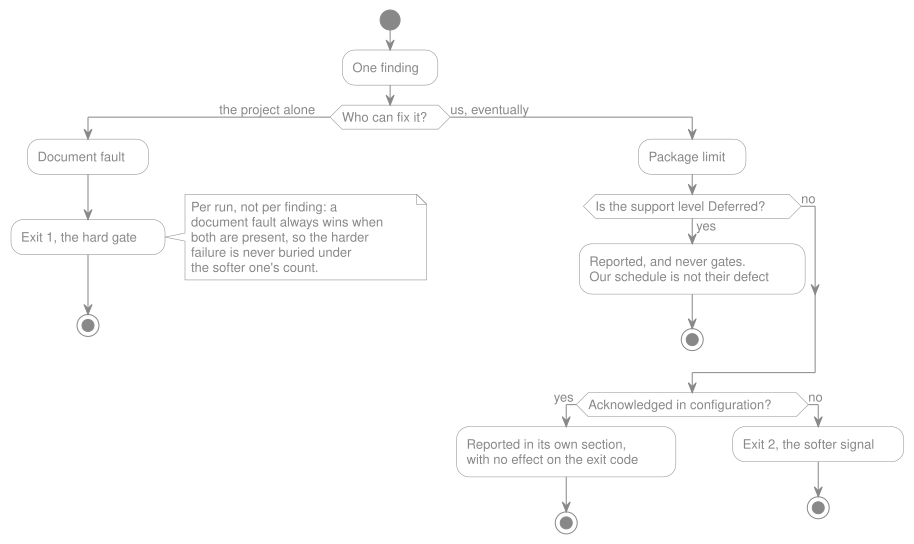

# The Doctor

> **In brief**
>
> - `spec:doctor` is `nginx -t` for your contract: what the package honors, what it does not, and the routing table that
>   results.
> - Read-only, always, and an architecture assertion says so rather than a convention nobody can check.
> - It reports everything it found rather than the first failure, and prints the outcome on a clean run too.
> - A document fault and a package limit never share an exit code: `0` clean, `1` a document fault, `2` a package limit.
> - **Not built yet:** the [baseline](./glossary.md#baseline) and driver sections, which print a `[not checked]` line
>   instead of passing quietly.

`spec:doctor` is how this package keeps its second rule: **a construct it does not honor must produce a diagnostic.**
What is honored in the first place lives in [`openapi-support.md`](./openapi-support.md); this document owns how any of
it is reported.

> **Shipped, in its Phase 1 form.** `spec:doctor` reads the ten sections whose inputs already existed:
> [configuration](#what-it-checks), document validity, version, references, [support findings](#what-it-checks)
> (`Rejected` constructs the reading pipeline already collects, `operationId` required on a `public` + `stable`
> operation, and one summary line per [`Deferred`](./glossary.md#deferred) construct actually present),
> [routing outcome](#what-it-checks) (shadowing included), [drift](#what-it-checks), and
> [installation](#what-it-checks). `--json` ships alongside the text report. Also shipped: the
> [lifecycle rules](./lifecycle.md#the-doctor-rules-that-follow) — a deprecation with no `x-sunset`, a date that has
> passed, a date nothing can read, the `beta` listing and the [protection report](./glossary.md#protection-report) — and
> the `security` finding, which names every operation whose declared requirements this phase does not apply yet. **Not
> yet built:** the [baseline](#what-it-checks) and [drivers](#what-it-checks) sections, and the `security` section in
> its enforcing form — see the [Roadmap](../project/roadmap.md) for all three. Both unbuilt sections still print, with a
> `[not checked]` line saying what they do not diagnose, so a green exit is never read as covering them. Items marked
> `Open` below are undecided.

Rule 2 has an obvious failure mode. A package that reports every unhonored construct at boot is a package that shouts on
every request, and a tool that shouts constantly gets its output filtered out — at which point the diagnostic exists and
nobody reads it, which is rule 2 defeated by its own enforcement.

**Decision: the diagnostics get their own command, `spec:doctor`. `nginx -t`, not a log line.**

The model is deliberate. `nginx` does not warn you about your configuration on every request; it gives you one command
that answers _"is this configuration good?"_, exits non-zero when it is not, and is therefore the thing you run before a
reload and the thing CI runs on every commit. That is the shape this package needs, for the same reason: a Spec-First
package's most valuable output is not "your request failed", it is **"here is exactly what your contract will and will
not do once loaded"** — and that answer is worth reading _before_ the app runs, not during.

This is not a Phase 2 developer-experience nicety. **It is the enforcement mechanism for rule 2, so it ships with the
first thing that reads a spec** — see the [Roadmap](../project/roadmap.md).

## The contract

- **One command, not two — validation is centralized.** "Is my document valid OpenAPI" and "will this package honor it"
  are genuinely different questions, and they are deliberately answered in one place. Every check that reads the spec
  shares one report format, one exit contract, and one place to add the next check. Splitting them would mean two
  commands to wire into CI, two output formats to parse, and a standing question about which one to run. Validity is the
  doctor's first section, not a separate command.
- **The exit code is the API.** Non-zero means at least one construct in the document will not be honored as written.
  Zero means none will — with one deliberate exception: [`Deferred`](./openapi-support.md#support-levels) rows report
  what the package has not built yet, and do not fail a pipeline over our roadmap. Zero is therefore _nothing here is
  being dropped without a decision behind it_, not _everything in this document is implemented_. That single property is
  what makes the command usable as a CI gate and a pre-deploy gate, and what stops the report from becoming decorative.
- **Machine-readable output.** Real specs are large, and the report grows with them. A `--json` flag lets CI annotate a
  pull request instead of dumping a wall of text, and lets tooling — including AI agents, which is a first-class use
  case for this package — consume the findings without parsing prose. Cheap to design in, awkward to retrofit.
- **Read-only, always.** It never writes a cache, never touches the database, never mutates state, so it is safe to run
  anywhere it has something to read. That caveat is real: a deployment that ships only the generated PHP has no
  specification on disk, and the doctor's contract checks have nothing to work from there. Its natural homes are
  development and CI, where the whole repository is present.
- **Report everything, not the first failure.** `nginx -t` stops at the first syntax error because a config file is a
  linear thing. A support matrix is not: a developer needs the full list of what was ignored in one pass, otherwise
  adoption becomes a whack-a-mole loop.
- **Every finding names the document position.** File, JSON pointer, and the
  [support level](./openapi-support.md#support-levels) that applies. A finding you cannot locate is a rumor.

    **What Phase 1 actually carries, stated rather than promised.** The support level prints on every finding that has
    one, in the text report and in `--json` both. The JSON pointer is filled by the sections that compute a finding here
    and know the position exactly — the `operationId` rule, and shadowing, which points at the operation that will never
    be reached. It is **empty** in two cases, and each is a property of the finding rather than a gap to fill later:

    - **A finding translated out of a reading-pipeline fault.** Those exceptions carry their position in prose inside
      the message, not as structured data — closing that means widening `Parsing\Exceptions\`, which is a change to what
      the build refuses rather than to what the doctor reports.
    - **A `Deferred` count.** One line stands for every occurrence of the construct, so naming one position would point
      a reader at an arbitrary one and imply the rest are elsewhere.

    A consumer parsing `--json` should read `pointer` as "empty or a pointer", never as "always present".

- **It reports the outcome, not only the problems.** The resolved routing table — which routes will exist, in which
  order, mapped to which controller and method, and whether that controller exists — is the single most useful thing
  this command can print. Most runs will be clean, and a command that prints nothing on success teaches the developer
  nothing about what the spec actually did.

## Flags

Centralizing every check in one command means that command needs a way to narrow what it runs.

| Flag              | Status  | Purpose                                                                                |
| ----------------- | ------- | -------------------------------------------------------------------------------------- |
| `--spec`          | Shipped | Read this specification instead of the configured one.                                 |
| `--json`          | Shipped | Machine-readable findings, for CI annotation and for tooling that consumes the report. |
| `--check=syntax`  | Planned | Document validity only: is this valid OpenAPI.                                         |
| `--check=honored` | Planned | Support findings only: what this package will and will not honor.                      |

Those two values do not partition the [sections below](#what-it-checks) — drift, installation and the baseline check
fall under neither, and inventing a value per section would turn a filter into a second command. **Open:** whether
`--check` names sections directly rather than naming two categories.

**`--json` has two shapes, and a consumer needs both.** A run that produced a report emits the full object — `spec`,
`specFileFound`, `version`, `configuration`, `routes`, `findings`, `notes`, `summary`. A refusal the command could not
proceed past at all — an unset `spec.path`, an unusable setting — emits `{"error": "…"}` and nothing else, with exit
code `1`. The two are deliberately not merged: a report with every section empty would claim the document was read and
found clean, which is the opposite of what happened. Branch on the presence of `summary`, not on the exit code.

**`notes` says what a run did not cover**, keyed by section, each entry carrying `checked` and `note`. `checked: false`
is a section that did not run — its inputs were missing, or this release does not implement it — and the text report
prints those as `[not checked]` and names them again under the summary. `checked: true` is a section that ran on less
than it needed, and its findings stand. **This is the key to read before trusting a zero exit code**: zero means nothing
in what ran is being dropped without a decision behind it, and `notes` is how you know what ran.

The doctor takes no flag that lets it reach the network. It has no reason to: every remote reference is already
[vendored locally](./remote-references.md#a-remote-reference-is-a-dependency-not-a-cache-entry), so a blocked or missing
reference is diagnosed by reading the working tree, and fetching belongs to the build. A `--bypass-allowlist` escape
hatch, if one is ever wanted, belongs on the fetching path, not here.

Two constraints on any flag added here, and they are the reason this list is short:

- **A filtered run's exit code covers only what it ran.** `--check=syntax` exiting zero means the document is valid, not
  that the package will honor it. The report says which checks were skipped, on every run, so a green exit is never
  mistaken for a full pass.
- **A flag that changes what the package would actually do makes the run non-representative, and the report must say
  so.** A clean run under such a flag does not predict a clean boot, so the report labels it, and CI has no business
  using it. Without that label, a flag quietly breaks the one property that makes the exit code worth anything.

## Two kinds of finding, never mixed

A single command answering both questions only works if the report never blurs them. **"Your document is broken" and
"this package cannot honor your document" are different problems, with different owners, different fixes, and different
urgency** — and a developer who cannot tell them apart at a glance will treat the whole report as noise.

| Class              | Means                                                                                                                                                                                                                                                                                                             | Who fixes it                                                           | How                                                                                                                        |
| ------------------ | ----------------------------------------------------------------------------------------------------------------------------------------------------------------------------------------------------------------------------------------------------------------------------------------------------------------- | ---------------------------------------------------------------------- | -------------------------------------------------------------------------------------------------------------------------- |
| **Document fault** | The document is not valid OpenAPI, is internally inconsistent, or breaks a rule this package requires of a promise the document itself made: schema violations, an unresolvable `$ref`, a path parameter declared nowhere, an `operationId` missing from an operation that declared itself `public` and `stable`. | The spec author, or whoever owns the project's own configuration.      | Fix the document, the configuration, or run the build. There is no other option, and the package will not guess.           |
| **Package limit**  | The document is correct. This package does not honor the construct.                                                                                                                                                                                                                                               | Us, eventually — it is a roadmap item, not a defect in their contract. | The consumer changes the spec, waits for support, or [acknowledges the limit](#acknowledged-limits-the-consumers-opt-out). |

The distinction has to survive into the output, not just the prose here: separate sections, distinct labels, and
**distinct exit codes**, so a CI pipeline can gate hard on document faults while treating package limits as a softer
signal. `0` clean, `1` at least one document fault, `2` no document fault but at least one package limit. A document
fault always wins when both are present, so the harder failure is never buried under the softer one's count. One level
is deliberately excluded from both: `Deferred` — see [openapi-support.md](./openapi-support.md#support-levels) — never
gates the exit code, however many of them a document carries, because recognizing a construct the roadmap has not built
yet is a fact about our schedule, not a defect worth failing a pipeline over.



_How a finding reaches an exit code._

The diamond at the top is the whole classification rule, and
[the section below](#the-class-is-decided-by-who-can-fix-it-not-by-whether-the-document-parses) is what made it that
question rather than whether the document parses. Of the four endings, two gate a pipeline.

The rule that follows from this: **a package limit is never reported as if the consumer made a mistake.** They wrote a
valid contract. We are the ones who cannot serve all of it yet, and the message says so.

### The class is decided by who can fix it, not by whether the document parses

The two-class model above was first written about the document alone, and three findings do not fit that reading: drift,
installation, and `operationId` missing on a `public` + `stable` operation. None of the three is the document failing to
parse, and none is this package refusing a construct it does not support either — so each was, for a while, filed as a
document fault with an in-code comment apologizing for it. Three findings needing the same exemption is the model
missing a case, not three sites each owing an argument.

**Decided: the dividing line is who can fix it, and a document fault is anything only the project can.** That covers all
three:

- **`operationId` on `public` + `stable`.** The key is optional in OpenAPI, so the document is valid — but the document
  made the promise, and this package publishes the rule that the promise requires an identity that survives a rename.
  Only the author can add it. The finding still carries its `Partial`
  [support level](./openapi-support.md#support-levels), which is what says the construct is honored when present.
- **Drift.** The specification and the [generated tree](./glossary.md#generated-tree) disagree. `spec:build` is the fix,
  and only the project can run it.
- **Installation.** The project's `generated.path`, `generated.namespace` and `composer.json` disagree with each other,
  or its `.gitignore` excludes a directory its build depends on. Nothing in this package can settle any of that.

A package limit stays what it always was: **the document is correct and we do not honor the construct.** That is the
class whose message must never read as the consumer's mistake, and the narrowing above is what keeps the three findings
that are the project's own problem out of it — where their softer exit code would have understated them.

## What it checks

Provisional, and expected to grow one section per honored construct.

**Every section in this table prints on every run, including the two this release does not check.** Baseline and Drivers
have no inputs yet, so each prints a `[not checked]` line naming what it does not diagnose, and the summary names them
again. A section absent from the report is one a green exit silently claims to have covered. The same mechanism carries
a section skipped on _this_ run: drift is not checked when the document could not be read, because `spec:build` would
refuse that document before writing anything, so nothing would be written or pruned.

**A section comes off that list in the change that builds it**, which is the only way an entry is meant to be removed.
Security and Lifecycle were both on it one release ago and are not now.

| Section           | Answers                                                                                                                                                                                                                                                                                                                                                                                                                                                                                                                                                                                                                                                                                                |
| ----------------- | ------------------------------------------------------------------------------------------------------------------------------------------------------------------------------------------------------------------------------------------------------------------------------------------------------------------------------------------------------------------------------------------------------------------------------------------------------------------------------------------------------------------------------------------------------------------------------------------------------------------------------------------------------------------------------------------------------ |
| Configuration     | Are the spec files found and readable? Which allowlist and options are in effect?                                                                                                                                                                                                                                                                                                                                                                                                                                                                                                                                                                                                                      |
| Document validity | Is this valid OpenAPI? The parser does not answer this in its library API — see [parser caveats](./openapi-support.md#parser-caveats) — so the doctor owns it.                                                                                                                                                                                                                                                                                                                                                                                                                                                                                                                                         |
| Version           | Which version was detected, and which [strategy](./openapi-support.md#handling-30-and-31-the-version-strategy) will handle it.                                                                                                                                                                                                                                                                                                                                                                                                                                                                                                                                                                         |
| References        | Unresolved `$ref`, references blocked by the [allowlist](./remote-references.md), and **`$ref` cycles — checked before the document reaches the parser**, which exhausts memory on them rather than raising. See the [parser caveats](./openapi-support.md#parser-caveats).                                                                                                                                                                                                                                                                                                                                                                                                                            |
| Support findings  | Every `Partial`, `Ignored` and `Rejected` construct in the document, with its position where the section computes the finding itself — see [the contract](#the-contract) for the two cases that carry no pointer, and why neither is a gap. `Deferred` constructs get one summary line each, naming a count rather than a position, because the level's own definition forbids one finding per occurrence.                                                                                                                                                                                                                                                                                             |
| Routing outcome   | The routes that will be registered, in order, with their targets — plus shadowing, where an earlier templated path swallows a later one, literal or templated. **A stated limit: only a path swallowed _entirely_ is reported.** An earlier `/users/{id}` shadows a later `/{owner}/{repo}` for requests whose first segment is `users` and no others, and calling a route that answers every other value "never reached" would be false. Being unreachable for _some_ inputs is a different finding, and not one this section makes.                                                                                                                                                                  |
| Security          | Today, one thing: every operation whose contract declares `security`, listed individually, because this phase registers its route without applying any of it. Once [enforcement](../project/roadmap.md) lands, that finding is deleted and this section becomes a `securitySchemes` name with no guard of the same name, a scheme type the [built-in middleware](./security.md#one-middleware-one-question-does-the-model-have-the-scope) cannot enforce at all, and an authenticated model missing the interface the middleware calls. Its own section rather than a line among others, either way, because it is the one finding that can turn a documented-as-protected endpoint into a public one. |
| Drift             | Whether the generated code still matches the specification. The runtime [cannot notice](./code-generation/index.md#the-runtime-never-sees-the-spec) that someone edited the spec and forgot to build, so this check is the only thing standing between that mistake and production.                                                                                                                                                                                                                                                                                                                                                                                                                    |
| Lifecycle         | The [`x-sunset` and `x-lifecycle` rules](./lifecycle.md#the-doctor-rules-that-follow), plus the protection report: how many public operations are actually `stable`, and therefore how much of the API is protected at all. A removal date that has passed is a finding; one that is merely approaching is reported beside the protection report and never touches the exit code, so a run cannot fail on a day nobody changed anything.                                                                                                                                                                                                                                                               |
| Installation      | That the vendored directory is not gitignored, and that the generated path and namespace agree with what `composer` autoloads. Both are silent misconfigurations whose symptoms appear far from their cause.                                                                                                                                                                                                                                                                                                                                                                                                                                                                                           |
| Baseline          | Whether the specification's previously committed version can actually be read from git — reachable history, not a shallow clone, and the file itself tracked rather than gitignored. Without this, [breaking-change detection](./lifecycle.md#unstable-by-default-and-what-stable-costs-us) silently compares against nothing and reports a clean run for the wrong reason.                                                                                                                                                                                                                                                                                                                            |
| Drivers           | For each [driver-based feature](./drivers.md): an unrecognized driver name, and a mapping missing a key its driver needs. Plus each feature's own structural rules, which the feature owns — for rate limiting, [429 declarations that disagree between operations](./rate-limiting.md#the-429-response-use-a-ref-and-the-reason-is-not-only-dry), since one mapping cannot serve two spellings of a header.                                                                                                                                                                                                                                                                                           |

## Running it in CI

Two things a pipeline needs told, and neither is obvious from the exit code alone.

**`git` has to be on the `PATH` for the installation check to run.** The vendored-directory check asks
`git check-ignore` rather than reimplementing `.gitignore` resolution — see [stack.md](../project/stack.md) — and
without a `git` executable it reports "cannot be determined", which is silence rather than a pass. A slim CI image that
installs PHP and not git gets a report one check short. The report says so: the Installation section prints what it
could not determine, and `--json`'s `notes` carries the same answer.

**Two rules make a previously green contract go non-zero, and both are permanent by design.** They are the reason to
read this section before wiring the command into a pipeline that already passes:

- **A contract declaring operation-level `security` exits `2`**, every run, until [enforcement](../project/roadmap.md)
  lands. There is no opt-out, and that is the point: the route is registered with no authorization check behind it, so
  an endpoint the contract documents as protected is served as public. See [security.md](./security.md).
- **A `deprecated: true` with no `x-sunset` exits `1`.** Harder edge, because it is a document fault rather than a
  package limit: it gates hard, and only the contract's author can fix it. See
  [the lifecycle rules](./lifecycle.md#the-doctor-rules-that-follow).

**Exit code `2` is not a failure in the usual sense, and `spec:doctor || exit 1` treats it as one.** `2` means the
document is correct and this package does not honor part of it — a roadmap item, not a defect in the contract. Whether
that should stop a pipeline is a policy choice, and it has to be made deliberately:

```sh
# Gate on document faults only; report package limits without failing.
php artisan spec:doctor; code=$?
[ "$code" -eq 1 ] && exit 1
[ "$code" -eq 2 ] && echo "::warning::spec:doctor reported package limits"
exit 0
```

A team that wants both to fail writes `spec:doctor` on its own and lets any non-zero code through. What no team should
write is a recipe that fails on `2` without having decided to — which is the reason the two codes are distinct at all.

## Open questions on the doctor

- **What still happens at boot.** `Rejected` fails at boot unless
  [acknowledged](#acknowledged-limits-the-consumers-opt-out), in which case the construct is skipped — the doctor is a
  check, not a substitute for refusing to load a spec the package cannot serve. Whether anything _below_ `Rejected`
  surfaces at boot at all, or whether the doctor is the only channel, is still open. Since the runtime loads generated
  PHP rather than a specification, "at boot" now means "baked into what the build emitted", which narrows the question
  rather than answering it.

When a command reference document exists, the usage details move there and this section keeps only the reasoning. It
lives here for now because the doctor is what makes the [support levels](./openapi-support.md#support-levels) mean
anything.

## Acknowledged limits: the consumer's opt-out

**Decision: a consumer can declare, in configuration, that they accept a limit — and the package then stops treating it
as a problem.**

Rule 2 assumes the reader can act on the diagnostic. Often they cannot. The spec comes from another team, from a vendor,
from a generator that always emits the same construct, and it is not theirs to change. For that developer a permanent,
unfixable warning is not information — it is a broken window, and the first thing they will look for is the switch that
turns the whole package quiet. Better to hand them a precise switch than to let them reach for a blunt one.

Acknowledgement is not the same as suppression, and the difference is the whole design:

- **It is enumerated, never global.** You list the specific constructs you accept. There is no "silence everything"
  option, because a spec that grows a new unhonored construct next month must still speak up — you never acknowledged
  _that_ one.
- **It stays visible.** Acknowledged items still appear in the doctor's report, in their own section, not folded into a
  count and not hidden. They stop _failing_; they do not stop _existing_. A configuration file nobody ever reads again
  is how accepted debt becomes forgotten debt.
- **Stale acknowledgements are themselves a finding.** When a construct you acknowledged no longer occurs in your spec,
  or the package has since grown support for it, the doctor says so, and you delete the line. Without this, the config
  only ever accumulates.
- **It is reviewable.** It lives in the application's config file, in version control, in diffs. The closest analogue in
  this ecosystem is a PHPStan baseline: an explicit, versioned list of accepted debt, where new violations still fail
  the build.

### Acknowledging changes behavior, not just noise

This is the part that must never be understated in the documentation we ship. Acknowledging a `Rejected` construct is
what allows the spec to load at all — so it is also the moment the construct is **dropped**. Acknowledge a `trace`
operation and the document still describes an endpoint that will answer 404. That is a legitimate choice, and it is the
consumer's to make, but the report has to state the consequence in those terms rather than reporting a clean bill of
health.

Which is why **security acknowledgements are never collapsed.** A consumer may accept that a `securitySchemes` type is
not one the [built-in middleware](./security.md#one-middleware-one-question-does-the-model-have-the-scope) can enforce
at all — `mutualTLS`, for instance — that is their call, but every affected operation is listed individually, on every
run, forever. This is the one place where being annoying is the correct behavior: the finding is that an endpoint the
contract describes as protected is not.

### Open questions on acknowledgement

- **Granularity.** Per construct (`trace: accepted` everywhere) covers the vendor-generator case that motivates the
  feature. Per construct _and_ location covers the one weird endpoint. Starting at the construct level and widening
  later is a **minor** release; the reverse is not.
- **Whether a reason string is required.** Requiring a justification on each entry is friction that pays for itself the
  day someone reads the config a year later and cannot remember why. It is also the kind of opinionated requirement
  [rule 3](./openapi-support.md#the-four-rules) invites.
- **The scope of a `Rejected` acknowledgement** — skipping the offending operation is the leading answer, with a
  `rejected_behavior: skip | fail` style option if the choice turns out to be worth giving away. Deliberately left to be
  settled against real code rather than in the abstract: the difference between the two only becomes concrete once there
  is a spec loader to watch.
- **The config keys themselves.** Public API surface. Not chosen.
