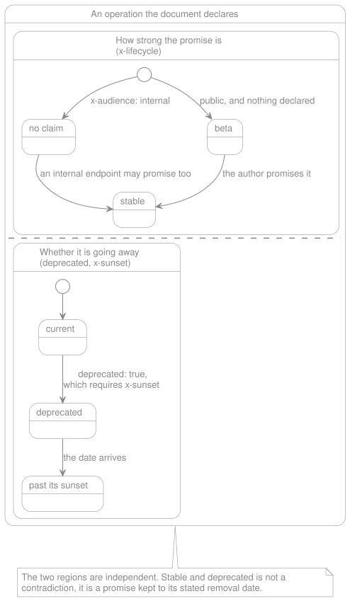

# Operation Lifecycle

> **In brief**
>
> - `x-audience` says who an operation is for. `x-lifecycle` says how strong a promise it carries.
> - A public operation that declares no `x-lifecycle` is `beta`: unstable until somebody says otherwise.
> - `deprecated` is OpenAPI's own key, so it stays out of `x-lifecycle` and the package reads both.
> - The doctor enforces the sunset rules today. It reports `stable` without protecting it yet, and the protection report
>   says so.
> - **Not built yet:** the RFC 8594 `Sunset` headers the generated code will send, in Phase 2.

OpenAPI can say an operation is deprecated. It cannot say how strong a promise the operation carries before that, nor
when it disappears — which is the only part a consumer can plan around. This document owns the extensions that close the
gap, and the enforcement that gives them teeth.

> **Partly shipped.** The three extension keys are read with their defaults resolved, and
> [the doctor rules over them](#the-doctor-rules-that-follow) run: a deprecation with no `x-sunset`, a date that has
> passed, a date nothing can read, an unrecognized `x-lifecycle` value (refused at read time, so it is reported under
> the doctor's Document validity section rather than its Lifecycle one), the `beta` listing, and the protection report.
> **Not built yet:** [breaking-change enforcement](#unstable-by-default-and-what-stable-costs-us) — so
> `x-lifecycle: stable` is a declaration the doctor reports on, not yet a rule that fails a build — and the
> [RFC 8594 headers](#the-runtime-payoff) the generated code will emit. Both are in the
> [Roadmap](../project/roadmap.md). Items marked `Open` are undecided.

**Decision: the package defines three extension keys to close that gap.**

| Key           | Where     | Value                                                                                   |
| ------------- | --------- | --------------------------------------------------------------------------------------- |
| `x-audience`  | Operation | `public` or `internal`. Absent means `public`.                                          |
| `x-lifecycle` | Operation | `beta` or `stable`. Its default [depends on the audience](#two-keys-one-discriminator). |
| `x-sunset`    | Operation | The date the endpoint stops being served.                                               |

## Two keys, one discriminator

How strong a promise an operation carries, and who it is promised to, are two different questions. Two axes, so two
keys, with the audience acting as the discriminator that sets the other's default:

| `x-audience`       | Default `x-lifecycle` | Reasoning                                                                                                                      |
| ------------------ | --------------------- | ------------------------------------------------------------------------------------------------------------------------------ |
| `public` (default) | `beta`                | Somebody outside this codebase may depend on it. The stage is a claim you have to make.                                        |
| `internal`         | none                  | Same application on both ends. Requiring a lifecycle stage on every internal route is ceremony for a promise nobody asked for. |

Three constraints make this safe rather than merely convenient:

- **`x-audience` itself defaults to `public`.** This is not a coin flip — it is the same principle as defaulting to
  `beta`. Omission must never be the cheaper path to less protection, because omission is what happens when a spec is
  imported, generated, or written in a hurry. Declaring an endpoint internal is an act; being treated as public is what
  happens by default.
- **A missing lifecycle is the absence of a claim, not a prohibition.** An internal endpoint can still declare
  `x-lifecycle: stable`, and it can still be `deprecated` with a full
  [`x-sunset` treatment](#the-doctor-rules-that-follow) — internal consumers deserve a removal date as much as anyone.
  They simply do not need a promise on every route to get one.
- **Demoting `public` to `internal` is reported.** This is the hole the composite otherwise opens: once a breaking
  change to a `stable` operation fails the build, flipping its audience to `internal` makes the failure disappear. That
  may be entirely legitimate — an endpoint really can stop being public — but it is _revoking a promise_, and a promise
  cannot be revoked silently in a package built on contracts. The report names it, in the same spirit as labelling a
  [non-representative run](./doctor.md#flags). Whether it merely reports or requires the same `info.version` bump a
  break would is **open**.

One consequence worth having: the doctor's protection report counts **public** operations only. A monolith with two
hundred internal routes should not have its _0 of 47 public operations are stable_ finding drowned by endpoints that
were never promised to anyone.

## `deprecated` is native, and stays out of `x-lifecycle`

OpenAPI already has `deprecated: true` on an operation. Putting `deprecated` in `x-lifecycle` as well would create a
second place to state one fact — the failure this whole package exists to prevent — so it is not in the value set at
all. **`x-lifecycle` says how strong the promise is. `deprecated` says the operation is going away. They are
independent, and both can be true.**

Removing it costs nothing and buys two things. There is no agreement rule to write, because there is nothing to disagree
with. And an operation can be `stable` _and_ `deprecated`, which is not a contradiction but the normal, well-behaved
case: a promise being honored right up to its stated removal date is exactly what a good deprecation looks like.

`x-lifecycle` is then a binary, and what it adds to OpenAPI is one word the specification has no way to express: whether
an operation is promised at all.

_The two tracks of an operation's lifecycle._ They move independently, which is the whole of the design.

The two tracks are drawn side by side because that is the shape the prose above argues for and the shape a single chain
of states would get wrong.

## The doctor rules that follow

| Rule                                                               | Why                                                                                                                                                                                                                                                                                                                                                                              |
| ------------------------------------------------------------------ | -------------------------------------------------------------------------------------------------------------------------------------------------------------------------------------------------------------------------------------------------------------------------------------------------------------------------------------------------------------------------------- |
| `deprecated: true` requires `x-sunset`                             | Your idea, and the strongest rule here. A deprecation with no end date is a wish. Requiring the date turns "we should remove this someday" into a commitment with a review attached.                                                                                                                                                                                             |
| `x-sunset` in the past is a finding                                | You are serving an endpoint you promised to remove. Nothing else in the system will ever notice.                                                                                                                                                                                                                                                                                 |
| `x-sunset` approaching is a warning                                | With a configurable horizon — `lifecycle.sunset_horizon_days`, 90 days by default — so it lands in CI while there is still time to act. It decides what is _mentioned_, never what fails: an approaching date is reported beside the protection report rather than as a finding, because a horizon nobody tuned must not turn a pipeline red on a day nobody committed anything. |
| An unrecognized `x-lifecycle` value is a finding                   | Extensions are untyped by nature: `x-lifecycle: stabel` is silent everywhere else in the toolchain. Refused where the document is read, so the doctor reports it under [Document validity](./doctor.md#what-it-checks) with every other refusal of that class rather than a second time here.                                                                                    |
| `beta` operations are listed                                       | The unstable surface of an API, on one screen, is worth printing even when nothing is wrong.                                                                                                                                                                                                                                                                                     |
| A `public` + `stable` operation without `operationId` is a finding | Promoting an operation to `stable` is the moment its generated class name stops being disposable. See [naming](./code-generation/generated-file-anatomy.md#when-operationid-is-absent-derive-from-method-and-path).                                                                                                                                                              |

### When a date-only `x-sunset` counts as passed

`x-sunset: 2026-06-01` states a calendar day, and a day is not a moment. The rule resolves it to `2026-06-01T00:00:00Z`
and reports the endpoint as still-served-after-removal from that instant, so **the last day an operation can be served
without a finding is 2026-05-31** — the day before the date it states. Both halves of the section agree on it: a sunset
falling today never prints as "sunset in 0 day(s)" among the approaching ones, because by then it has already passed.

Stated here rather than left to be derived, because the alternative reading is just as defensible — treating the stated
day as the last served day — and a boundary a reader has to infer from a comparison operator is one they will infer
wrongly at least once. Write a moment (`2026-06-01T12:00:00Z`) when the hour matters.

### The horizon is not in a config file you published before it existed

`lifecycle.sunset_horizon_days` arrived with the doctor's Lifecycle section. A project that published
`config/lara-spec-first.php` before that has no such key: `config()` returns null, the horizon
[falls back](#the-doctor-rules-that-follow) to 90 days, and nothing breaks — but the key is invisible in the one file
that team reads to find out what they can tune. Re-publish the config, or add the key by hand.

## Unstable by default, and what `stable` costs us

**Decision: a public operation with no `x-lifecycle` is `beta`.** You cannot claim a stability guarantee by omission —
claiming one is an act. This is the right default for the same reason the [allowlist](./remote-references.md) is empty
by default: the permissive state is the one you should have to opt out of, not into.

| Value                        | Means                                  | What the build does                    |
| ---------------------------- | -------------------------------------- | -------------------------------------- |
| `beta` (default when public) | Not yet promised to anyone.            | Permissive. Change it freely.          |
| `stable`                     | A production consumer depends on this. | **A breaking change fails the build.** |
| none (default when internal) | No claim made, and none expected.      | Permissive by intent, not by neglect.  |

Orthogonal to all of them, `deprecated: true` [remains native](#deprecated-is-native-and-stays-out-of-x-lifecycle) and
can accompany any value.

`stable` is worth promoting to the moment one production consumer exists — unless that consumer knowingly signed up for
instability, which is what [`x-audience: internal`](#two-keys-one-discriminator) records.

Four consequences, because a rule that fails a build has to be right:

**1. Failing on a breaking change requires a baseline, and the baseline is the specification itself — its previously
committed version, read from git.** Not the generated code, which was never meant to carry the whole contract, and not a
separate file the build writes: the specification is the only artifact this package keeps, so there is nothing else to
compare against. `git show` against the merge base is the mechanism, in the same spirit as
[git being the lock file](./remote-references.md#no-lock-file-git-is-the-lock) for vendored references — which means the
comparison needs history to exist, and [the doctor](./doctor.md#what-it-checks) is where a shallow clone or an untracked
specification gets caught, before it is mistaken for "nothing changed".

**2. "Breaking" is directional, and the direction inverts between request and response.** This is where implementations
get it wrong, so it has to be a written table rather than a judgement call:

| Change                     | On the request                                        | On the response                                                 |
| -------------------------- | ----------------------------------------------------- | --------------------------------------------------------------- |
| Adding a required field    | **Breaking.** Existing callers omit it.               | Not breaking, in the ordinary case.                             |
| Removing an optional field | Not breaking, in the ordinary case.                   | **Breaking.** A consumer was reading it.                        |
| Widening an enum           | Helps senders. Not breaking.                          | **Breaking.** A consumer must handle a value it has never seen. |
| Narrowing an enum          | **Breaking.** A value that was accepted no longer is. | Not breaking.                                                   |

That table is itself public API under [rule 4](./openapi-support.md#the-four-rules) — a change to what counts as
breaking changes whose build fails — and its exhaustive form is large enough to deserve its own phase rather than being
smuggled into the first release.

**3. The escape hatch already exists in the document: `info.version`.** A build that only says _you broke a stable
operation_ is an obstacle. A build that says **this change requires `info.version` to go from `2.4.1` to `3.0.0`, and
will pass once it does** has turned enforcement into instruction. It needs no config, no flag and no
[acknowledgement](./glossary.md#acknowledgement) entry — the contract carries its own version, and deliberately breaking
one becomes indistinguishable from publishing a major, which is exactly what it should be. Breaking on purpose stays
possible; breaking by accident stops being.

**4. The doctor must report how much of the API is actually protected.** A specification imported from elsewhere has no
`x-lifecycle` anywhere, so every public operation defaults to `beta` and the strongest rule in this document is silently
off for the whole API. _47 public operations, 0 stable_ is a finding under
[rule 2](./openapi-support.md#the-four-rules): protection that is off must never look like protection that passed.

## The runtime payoff

This is what makes these keys worth defining rather than documenting a convention: **the generated code can act on
them.** RFC 8594 standardises a `Sunset` HTTP header carrying exactly this date, and the IETF has a companion
`Deprecation` header in draft. A contract that declares a sunset can therefore produce an endpoint that announces it on
every response, to every client, without anyone writing that code.

Declared once in the spec, enforced in CI by the doctor, and advertised over HTTP by the generated controller — that is
the whole thesis of this package applied to a single field.

**Open**, four questions rather than one:

- The date format. `x-sunset` should almost certainly be RFC 3339, converted to the HTTP-date the header requires.
- Whether emitting the headers is on by default.
- The warning horizon the emitted header implies, as distinct from [the doctor's](#the-doctor-rules-that-follow), which
  is already configurable.
- The collision risk of a name as generic as `x-lifecycle`, which another tool may already define differently. A vendor
  prefix would remove the ambiguity at the cost of every consumer typing it.

## What this document does not cover

Four questions a reader arrives with that are answered elsewhere, or not yet answered at all:

- **These keys are not access control.** `x-audience: internal` says who an operation is _promised_ to, never who may
  call it: nothing in the routing or the middleware reads it. Who may call an operation is
  [`security.md`](./security.md)'s subject. The one place the key changes an artifact is the
  [sanitized public copy](./code-generation/publishing.md#internal-operations-are-excluded-not-merely-stripped), which
  leaves internal operations out entirely.
- **Nothing stops serving a sunset operation.** `x-sunset` is a date the doctor holds you to, not a switch. The build
  still emits the route the day after it passes, and the finding is the whole of the enforcement — removing an endpoint
  is an edit to the contract, which is the only place that decision belongs.
- **What counts as a breaking change is not settled here.** The table above states the direction; the exhaustive rule
  set is public API and lands with the phase that enforces it.
- **How any of this is printed belongs to [the doctor](./doctor.md).** This document owns the rules and their defaults.
  Exit codes, flags, the JSON shape and where each finding is grouped are that document's.
