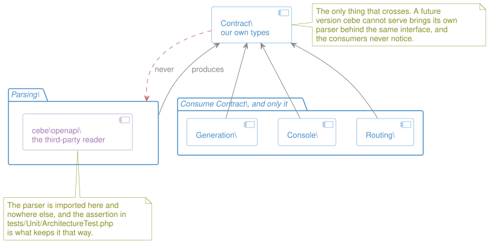
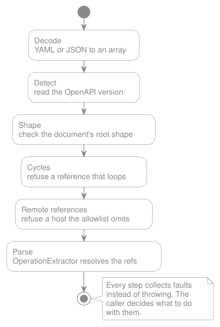

# OpenAPI Support

> **In brief**
>
> - The package reads both OpenAPI 3.0 and 3.1, and acts on a documented subset of what they allow rather than on all of
>   it.
> - Four rules decide every one of those calls, and the support matrix answers construct by construct.
> - When it meets a construct it does not act on, it says so. It never stays silent.
> - It reads a document in five fixed steps, and the order is part of the design: the cycle check cannot move.
> - Three defects in the parser underneath are recorded rather than worked around, each pinned by a permanent test.

This document is the reference for one question: **given a valid OpenAPI document, what does `lara-spec-first` actually
do with it?**

It exists because "supports OpenAPI 3.0 and 3.1" is not a truthful claim on its own. No tool in any ecosystem honors the
whole specification, and a Spec-First package that quietly ignores half of a contract is worse than one that never
claimed to read it, because the whole promise is that the spec is the source of truth.

> **Most of this is intent rather than behaviour, and the difference is marked per section rather than per file**, since
> this document fills in gradually across Phase 1, so a single banner would be a little more wrong with every release.
> Everything not named below states the **intent** for the first release and the reasoning behind it. Rows marked `Open`
> are undecided and must not be presented as settled, the same discipline [`stack.md`](../project/stack.md) applies to
> its own Status column.
>
> **Shipped:** [reading a document](#reading-a-document), [where the parser sits](#where-the-parser-sits-decided),
> extracting its operations into `Contract\` types, and generating the routes and controllers from them. Also settled by
> that build: `trace` is refused, and so is a path parameter Laravel's router could not match. Specifically:
> `Operation`, `HttpMethod`, `PathTemplate`, `Audience`, `Lifecycle` and `SecurityRequirement` all exist. The
> [version strategy](#handling-30-and-31) is the seam and is dispatched to, but so far it only rejects a root shape its
> version forbids: normalization happens in `OperationExtractor`, and what pins the 3.0/3.1 equivalence is a conformance
> class requiring both spellings of one contract to come out identical. `spec:doctor` ships too, reporting every level
> below against a document without ever writing one. The full state is on the
> [project board](https://github.com/users/Gcob/projects/1).

Seven subjects grew out of this file and own themselves now. The [four rules](#the-four-rules) below still govern all of
them:

| Document                                         | Owns                                                             |
| ------------------------------------------------ | ---------------------------------------------------------------- |
| [`doctor.md`](./doctor.md)                       | How any of this is reported, and how a consumer accepts a limit. |
| [`remote-references.md`](./remote-references.md) | A `$ref` that points at a URL.                                   |
| [`lifecycle.md`](./lifecycle.md)                 | How strong a promise each operation carries.                     |
| [`security.md`](./security.md)                   | How `security` becomes an authorization check.                   |
| [`drivers.md`](./drivers.md)                     | Extending the package where OpenAPI standardized nothing.        |
| [`rate-limiting.md`](./rate-limiting.md)         | Reading a limit neither OpenAPI nor the community standardized.  |
| [`pagination.md`](./pagination.md)               | The same problem, for pages.                                     |

## The four rules

**1. Parsing is not honoring.** The parser reads both 3.0.x and 3.1.x. The package _honors_ a subset. Every promise this
project makes must be about behavior, never about a version number. "We support 3.1" is meaningless; "we register routes
from `paths`, and we reject `trace`" is a promise.

**2. Silence is the enemy.** A construct the package does not honor must produce a diagnostic. If a spec declares
something and the package ignores it without a word, the document has stopped being the source of truth and nobody finds
out until production. This is the single most important rule here, and it is why the [support levels](#support-levels)
below are six rather than two: each one exists to say something specific out loud, or to be explicit that there is
nothing to say.

**3. Opinionated, and we own it.** Where the specification leaves a choice open, this package makes one and states it,
rather than inventing configuration for every fork in the road. A stated opinion a consumer can plan around beats a
flexible behavior nobody can predict. See the [project philosophy](../../README.md#stack--philosophy).

**4. Support levels are a compatibility contract.** Once published, this matrix is part of the public API surface,
exactly like class names and config keys. It moves along **two independent axes**, and conflating them is how a
guarantee gets weakened without anyone noticing.

**How much of the contract is honored**, from `Rejected` through `Ignored` and `Deferred` together, then `Partial`, then
`Supported`. `Ignored` and `Deferred` share a rung deliberately: both mean _not acted on_, and they differ only on the
second axis.

- Moving a row **up** this ladder is a **minor** release. It cannot break a spec that worked before.
- Moving a row **down** is a **major** release. Someone's contract stops being honored.
- Changing _how_ a `Supported` row behaves, the route order, the controller naming convention or the parameter mapping,
  is also **major**. Consumers have code written against it.

**What it does to the exit code** is not a ladder, and every move on it is **major, in either direction.** Making a row
noisier breaks pipelines that were green; making it quieter silently stops a pipeline from catching something it used to
catch. The second is the more dangerous of the two and the easier to mistake for an improvement: `Ignored` to `Deferred`
looks like generosity and is in fact the removal of a gate. A package whose entire promise is that a contract cannot
drift unnoticed does not get to weaken its own detection in a minor release.

## Support levels

Six levels. Every one except `Supported` and `Out of scope` says something out loud, and only two of them can make the
[exit code](./doctor.md#what-the-doctor-guarantees) non-zero:

| Level            | Meaning                                                                       | Behavior                                                                                                                               | Exit code                                                                                                |
| ---------------- | ----------------------------------------------------------------------------- | -------------------------------------------------------------------------------------------------------------------------------------- | -------------------------------------------------------------------------------------------------------- |
| **Supported**    | The construct is read and honored.                                            | Nothing to report.                                                                                                                     | None                                                                                                     |
| **Partial**      | Honored under stated conditions; outside them, it is not.                     | Diagnostic when a document leaves the supported subset. The conditions are written in this file, never left to the reader to discover. | Non-zero **only when the document leaves the supported subset**, so a spec that stays inside it is clean |
| **Ignored**      | In scope, present in the document, understood, and deliberately not acted on. | Diagnostic. The spec stays valid and the package keeps working, but the consumer is told the construct had no effect.                  | Non-zero                                                                                                 |
| **Deferred**     | Recognized, support planned, not built yet.                                   | One summary line per document, never one per occurrence.                                                                               | None                                                                                                     |
| **Rejected**     | The package cannot honor it and will not pretend to.                          | Hard error. The spec does not load.                                                                                                    | Non-zero                                                                                                 |
| **Out of scope** | Not this package's concern at all.                                            | No diagnostic. Listed here only so nobody has to wonder.                                                                               | None                                                                                                     |

**`Deferred` exists because the exit code has to stay reachable.** Without it, every construct the package has not built
yet is `Ignored`, every `Ignored` is a finding, and since `info` is mandatory in every OpenAPI document, _no
specification could ever exit zero_, which would kill the one property that makes `spec:doctor` usable as a CI gate, and
would push consumers to [acknowledge](./doctor.md#acknowledged-limits-the-consumers-opt-out) everything on day one,
leaving them deaf when real support arrives.

The distinction is about whose problem it is. `Ignored` says _your document says something this package will not act
on_, which is worth failing over. `Deferred` says _we have not built this yet_, a fact about our roadmap, not a defect
in your contract, and it does not get to fail your pipeline.

`Ignored` and `Rejected` differ in blast radius, not in honesty. A `deprecated: true` flag that changes nothing is an
`Ignored` row: annoying to be told about, fatal to nobody. A `trace` operation the package cannot route is `Rejected`,
because loading the spec anyway would leave a documented endpoint silently missing.

## Handling 3.0 and 3.1

**The version differences live behind a strategy, one concrete implementation per OpenAPI minor version.** Not
conditionals sprinkled through the codebase.

The reasoning:

- **The differences are not cosmetic.** 3.1 changed the schema dialect, not just the syntax. Handling it with
  `if (version === '3.1')` scattered across the parser, the router and the mocker means every future version multiplies
  the branches in every file that ever touched a schema.
- **A third version is a matter of when, not if.** Adding `OpenApi32Strategy` should mean writing one class, not
  auditing the codebase for version checks.
- **Readability is a real argument, not a bonus.** A reader who wants to know how 3.1 nullability works should find it
  in one file, not by grepping for a version string.

### What is shared and what is version-specific

The seam matters more than the pattern. Putting it in the wrong place duplicates work for no gain:

| Concern                                  | Where it belongs     | Why                                                                                                                                |
| ---------------------------------------- | -------------------- | ---------------------------------------------------------------------------------------------------------------------------------- |
| Reading the file, YAML/JSON decoding     | **Shared**           | Byte-level work, identical in both versions. See [reading a document](#reading-a-document) for the order the steps run in and why. |
| Multi-file loading and `$ref` resolution | **Shared**           | JSON Reference mechanics are the same. The [allowlist](./remote-references.md) is a security policy, not a version concern.        |
| Schema interpretation                    | **Version-specific** | This is where 3.0 and 3.1 disagree. See the table below.                                                                           |
| Document shape rules                     | **Version-specific** | `paths` is required in 3.0 and optional in 3.1; `webhooks` exists only in 3.1.                                                     |
| Route registration                       | **Shared**           | It consumes the normalized output, and must never see a version number.                                                            |

The test of a correct seam: **nothing downstream of the strategy knows which version was loaded.** If the router or the
mocker has to ask, the normalization is incomplete.

### The differences the strategy must absorb

Each row is a disagreement the two versions have, and what it becomes once the strategy is done with it. **The
right-hand column is the decision**, which is what makes this a specification of the seam rather than a list of things
to watch out for.

| Subject                                 | 3.0.x                                    | 3.1.x                                         | Normalized to                                                 | Why that direction                                                                                                                                                                              |
| --------------------------------------- | ---------------------------------------- | --------------------------------------------- | ------------------------------------------------------------- | ----------------------------------------------------------------------------------------------------------------------------------------------------------------------------------------------- |
| `type`                                  | A single string                          | A string or an array of strings               | Always a list, empty when nothing is written                  | The parser declares this `Type::STRING` (`Schema.php:92`) and does not enforce it, so a 3.1 array arrives unchecked either way.                                                                 |
| Nullability                             | `nullable: true`                         | `type: [string, "null"]`                      | A `null` member of that same list                             | One place states it, so there is no second one to disagree. A `nullable` with no `type` beside it adds nothing: a list holding only `null` would read as a constraint its author did not write. |
| `exclusiveMinimum` / `exclusiveMaximum` | Boolean, modifying `minimum` / `maximum` | A number, standing on its own                 | The number. A 3.0 bound moves, and `minimum` is left empty    | One property name, two semantics (`Schema.php:155-161`). A number carries the whole claim where a boolean needs a sibling to mean anything, and keeping both would state one constraint twice.  |
| `const`                                 | Does not exist                           | A single allowed value                        | An `enum` of one value                                        | Which is what it is, and it spares every reader a second keyword to check.                                                                                                                      |
| Examples                                | `example` (singular, any value)          | `examples` (an array)                         | A list. `examples` wins when both are written                 | A document carrying the two has migrated halfway, and the newer half is the one stating the intention.                                                                                          |
| A file part                             | `format: binary`                         | `contentMediaType`                            | One flag, and `format` keeps no copy of `binary`              | 3.1 dropped the format vocabulary `binary` belonged to, so neither spelling can be the shared one. See [uploads.md](./uploads.md#the-schema-names-the-file-part).                               |
| Schema dialect                          | A JSON Schema subset                     | Full JSON Schema 2020-12                      | Nothing: the [matrix](#schemas) states a position per keyword | The widest gap, and the source of most of the [parser caveats](#parser-caveats).                                                                                                                |
| `paths`                                 | Required                                 | Optional                                      | Nothing: a document-shape rule rather than a schema one       | A valid 3.1 document with only `webhooks` and `components` must produce zero routes without failing.                                                                                            |
| `webhooks`                              | Does not exist                           | Top-level                                     | Nothing                                                       | See the [matrix](#the-support-matrix).                                                                                                                                                          |
| `$ref` siblings                         | Ignored                                  | `summary` and `description` allowed alongside | Nothing                                                       | The parser models this (`Reference.php`), we must decide whether we honor it.                                                                                                                   |

### The normal form a schema takes

**A schema reaches every generator as `Contract\Schema`, and it never carries a version.** Six of them read it: request
validation, response DTOs, DTO factories, the Faker mocker, spec-driven test data, and the sanitized public copy. What
follows is the whole of what one of them has to know, and none of it requires knowing which version was read.

| Reading                                  | Always gets                                              | Never has to                                                    |
| ---------------------------------------- | -------------------------------------------------------- | --------------------------------------------------------------- |
| `types`                                  | A list, possibly empty                                   | Handle a bare string, or a null                                 |
| `isNullable()`                           | The answer, read off that list                           | Look for a `nullable` field, which does not exist               |
| `soleType()`                             | The type, ignoring nullability, or null for a real union | Filter `null` out of the list at every call site                |
| `exclusiveMinimum`, `exclusiveMaximum`   | A number or null                                         | Read `minimum` to work out what a boolean meant                 |
| `enum`                                   | Every allowed value                                      | Check `const` as well                                           |
| `examples`                               | A list, possibly empty                                   | Check `example` as well                                         |
| `isFilePart`                             | Whether this is a file rather than a value               | Know that 3.0 wrote `format: binary` and 3.1 `contentMediaType` |
| A keyword the [matrix](#schemas) ignores | Nothing: there is no field for it                        | Wonder whether an empty value means unsupported or unwritten    |

**Where a spelling you wrote went is the [table above](#the-differences-the-strategy-must-absorb)**, which is the same
decisions read from the other side: that one answers "my document says X, what happens to it", this one answers "I am
holding a schema, what can I count on".

**One value has no equivalent in the document, and a caller does have to know about it.** A self-referential schema is a
supported contract and an infinite object graph, so the node that would have repeated an ancestor carries that
ancestor's JSON Pointer in `recursesTo` and nothing else. A tree, a comment thread and nested categories all produce
one. Truncating in silence would hand a generator a schema that is wrong rather than one that is incomplete, which
[rule 2](#the-four-rules) forbids.

### Where the parser sits: decided

The question was whether each concrete strategy should own its own file parser. The instinct behind it is right, since a
single parser for both versions _is_ a constraint, but the constraint is not where it first appears. Decoding is
version-agnostic: `symfony/yaml` turns bytes into a PHP array without an opinion about OpenAPI, and you cannot dispatch
on a version you have not decoded yet. The real limit is [cebe's **object model**](#parser-caveats), whose `Schema`
class is shaped for 3.0 and lets 3.1 keywords through as raw arrays.

**Decode once in shared code, dispatch on the decoded version, and let the strategy own the interpretation, with the
strategy interface expressed in our own types, never in `cebe\openapi\` ones.** A future version whose needs cebe cannot
meet can then bring its own parser behind the same interface without anything else noticing.

**Inside `Parsing\`, the schema work is split once more, and on the same line.** Walking the document, resolving its
references and cutting a recursive schema belong to the extractor, which is allowed to hold the parser's objects.
Deciding what a keyword _means_ belongs to the strategy, which is handed one flattened node at a time, with its children
already normalized, and never sees a `cebe\openapi\` type. That is what lets the strategy interface be expressed in our
own types while the walk still happens against someone else's.

**And the containment has an assertion behind it.** The package is laid out so that one namespace, and only one, may see
the parser:

| Namespace     | Owns                                                                  | Built   |
| ------------- | --------------------------------------------------------------------- | ------- |
| `Parsing\`    | Reading a document, and the only place `cebe\openapi\` may appear.    | Yes     |
| `Contract\`   | Our own types: what a strategy produces and everything else consumes. | Started |
| `Generation\` | Emitting PHP.                                                         | Yes     |
| `Console\`    | The commands.                                                         | Started |
| `Routing\`    | What the service provider loads at boot.                              | Yes     |



_The namespace boundaries._

The table says what each namespace owns; the picture says which way the dependency runs, which is what the arrangement
exists for. One box contains the third-party library, one type of thing leaves it, and the arrow back into `Parsing\` is
the one nothing may draw.

Inside `Parsing\`, `Guards\` holds the checks that can refuse to load a document: the reference cycle detector and the
remote reference guard. It is expected to stay small by design: this doctrine sends almost every check to
[the doctor](./doctor.md), which _reports_, and keeps here only what makes loading impossible or unsafe. Both of the
current members earn that: one guards a failure the parser does not survive, the other a request it would make on a
stranger's behalf. The remaining guard already implied by a decision elsewhere is the check that
[vendored references](./glossary.md#vendored-reference) are present, which
[frozen by default](./code-generation/index.md#the-build-is-frozen-by-default) requires.

The architecture test in `tests/Unit/ArchitectureTest.php` asserts it directly:

```php
arch('the OpenAPI parser stays inside Parsing')
    ->expect('cebe\openapi')
    ->toOnlyBeUsedIn('Gcob\LaraSpecFirst\Parsing');
```

That is stricter than forbidding the parser to the request path, and simpler: there is one boundary to state rather than
a list of namespaces to keep current as the package grows.

**And it is binding now rather than in principle.** `OperationExtractor` imports the parser, so the assertion has
something to constrain: it was written while the room was still empty, which cost nothing, and it started doing work the
day the first `use cebe\openapi\…` was added. Retrofitting it after the imports existed would have cost an audit.

**Honest about what it proves.** The assertion reads imports, not data. Importing a `cebe\openapi\` class outside
`Parsing\` fails it; handing the same content across the boundary as a plain array does not. The boundary is only as
real as the types crossing it, which is why `Parsing\` returns `Contract\` objects and why a second assertion forbids
`Contract\` from knowing anything about the layer that produced it.

## Parser caveats

Every row below was verified against the vendored `devizzent/cebe-php-openapi`. These are not criticisms of the library.
It is a low-level reader and it says so. They are the constraints our layer has to compensate for.

Line numbers cite the versions in `composer.lock` at the time of writing, including `laravel/framework` 13.x for the
[Laravel constraints](#laravel-constraints-we-do-not-fight) below. The behavior is what matters and it holds across the
supported range; the line numbers may not.

| Caveat                                                                                                                               | Evidence                                                                                                                                                                                                                                                                                                                      | What it means for us                                                                                                                                                                                                                                                                                                                                                                                                                                                                                                                                                                                                                                                                                                                                                                                                                                                                                                      |
| ------------------------------------------------------------------------------------------------------------------------------------ | ----------------------------------------------------------------------------------------------------------------------------------------------------------------------------------------------------------------------------------------------------------------------------------------------------------------------------- | ------------------------------------------------------------------------------------------------------------------------------------------------------------------------------------------------------------------------------------------------------------------------------------------------------------------------------------------------------------------------------------------------------------------------------------------------------------------------------------------------------------------------------------------------------------------------------------------------------------------------------------------------------------------------------------------------------------------------------------------------------------------------------------------------------------------------------------------------------------------------------------------------------------------------- |
| `validate()` is structural only. Validation against the OpenAPI JSON Schema exists **only in the CLI tool**, not in the library API. | Parser `README.md`, `OpenApi.php:86`                                                                                                                                                                                                                                                                                          | We cannot rely on the parser to reject a malformed spec. Rejecting bad documents is our job, and it is a headline feature of a Spec-First package.                                                                                                                                                                                                                                                                                                                                                                                                                                                                                                                                                                                                                                                                                                                                                                        |
| Unknown properties are kept **as raw PHP arrays**, silently.                                                                         | `SpecBaseObject.php:142-144`                                                                                                                                                                                                                                                                                                  | 3.1 JSON Schema keywords (`const`, `prefixItems`, `$defs`, `if`/`then`/`else`, `patternProperties`, `dependentSchemas`, `unevaluatedProperties`, `contentMediaType`) survive, but never as `Schema` objects, **and any `$ref` inside them is never resolved**. The most dangerous caveat on this page, because nothing fails: you get a value, it is just wrong. It will bite the Faker mocker in Phase 2 hardest.                                                                                                                                                                                                                                                                                                                                                                                                                                                                                                        |
| `type` is declared as a string but 3.1 arrays pass through unvalidated.                                                              | `Schema.php:92`                                                                                                                                                                                                                                                                                                               | Our code must accept `string\|array` everywhere it touches a type, or normalize it at the boundary.                                                                                                                                                                                                                                                                                                                                                                                                                                                                                                                                                                                                                                                                                                                                                                                                                       |
| `exclusiveMinimum` / `exclusiveMaximum` accept both booleans and numbers with no version check.                                      | `Schema.php:155-161`                                                                                                                                                                                                                                                                                                          | The same property means different things depending on the document version. Only the strategy should ever see the raw form.                                                                                                                                                                                                                                                                                                                                                                                                                                                                                                                                                                                                                                                                                                                                                                                               |
| A Path Item's `$ref` is special-cased and is not a normal `Reference`.                                                               | `PathItem.php:73-78`                                                                                                                                                                                                                                                                                                          | Path-level `$ref` needs its own handling in the router.                                                                                                                                                                                                                                                                                                                                                                                                                                                                                                                                                                                                                                                                                                                                                                                                                                                                   |
| Remote `$ref` by URL is resolved transparently, by calling `file_get_contents()` on it.                                              | `ReferenceContext.php:217`                                                                                                                                                                                                                                                                                                    | Network I/O and an SSRF surface, handed to whoever wrote the document. Refused [before the parser sees it](#reading-a-document); see [remote references](./remote-references.md).                                                                                                                                                                                                                                                                                                                                                                                                                                                                                                                                                                                                                                                                                                                                         |
| `paths` is not required for 3.1 documents.                                                                                           | `OpenApi.php:91`                                                                                                                                                                                                                                                                                                              | Zero routes is a valid outcome, not an error.                                                                                                                                                                                                                                                                                                                                                                                                                                                                                                                                                                                                                                                                                                                                                                                                                                                                             |
| A pure `$ref` cycle exhausts memory instead of raising.                                                                              | Verified: `A: {$ref: B}` / `B: {$ref: A}` under `RESOLVE_MODE_ALL` dies in `JsonPointer.php:108` with _Allowed memory size exhausted_                                                                                                                                                                                         | The parser does carry cycle checks (`Reference.php:324,330`), but this shape recurses past them. A malformed document takes the process down rather than producing a diagnostic: the one failure mode the doctor cannot report on, because it never gets to return. **Detecting `$ref` cycles is our job, before the document reaches the parser.** An ordinary recursive _schema_ is fine; the two are [different things](#references-and-security).                                                                                                                                                                                                                                                                                                                                                                                                                                                                     |
| `components.pathItems` is not modelled at all.                                                                                       | Verified: `Components::attributes()` lists nine keys and `pathItems` is not among them                                                                                                                                                                                                                                        | A 3.1 document reusing a Path Item through `#/components/pathItems/…` resolves to a plain value, ends up with **no operations, and no error**, so the endpoint disappears in silence, which is the one outcome this package must never produce. Refused where it is read, naming the two forms that do work: a `$ref` to another path, and a `$ref` to another file. Both verified.                                                                                                                                                                                                                                                                                                                                                                                                                                                                                                                                       |
| A `$ref` whose JSON pointer lands inside data exhausts memory the same way a pure cycle does.                                        | Verified: `tests/Fixtures/ref-inside-example.yaml` and `tests/Fixtures/example-object-value.yaml`, each once accepted by `ReferenceCycleDetector` and each dying under `OperationExtractor::parse()` with _Allowed memory size exhausted_, `Reference.php:246` / `Reference.php:328` recursing without ever reaching a schema | A second way into the same failure as the row above, and the one a rule about key names cannot see: `#/components/schemas/A/example` is a legal pointer, `example` is legitimately data and is not walked, so no `$ref`-shaped node appears anywhere in the chain the guard collects. Only the parser, resolving the pointer against the already-built object tree, finds the `$ref` sitting inside that data and loops on it. **Guarded against:** the guard now [follows a reference into the position it points at](#reading-a-document), which is the one moment a literal becomes specification. Both documents raise a cycle fault today, and `tests/Conformance/KnownParserBugsTest.php` keeps its child process to pin the other half, that they no longer take the interpreter down, the same way `tests/Support/extract.php` and the "Subprocess assertions" row in [`stack.md`](../project/stack.md) describe. |
| An absent keyword is indistinguishable from one written with its default value.                                                      | `SpecBaseObject.php:361-393`, `Schema.php` `attributeDefaults()`                                                                                                                                                                                                                                                              | `__get()` falls back to `attributeDefaults()` and `hasPropertyValue()` is `protected`, so from our side an absent `additionalProperties` reads `true` exactly as an explicit `additionalProperties: true` does. The same holds for `nullable`, `exclusiveMinimum` and `exclusiveMaximum`, and for any boolean through the typed fallback. `__isset()` does not help: it returns `__get() !== null`, true for a defaulted key. **Read around**, and it is the one caveat on this page that is: extraction takes its keys from `getSerializableData()`, which returns the written properties with no defaults folded in, so an absent `additionalProperties` reaches the contract as silence rather than as the `true` the parser invents. It also recovers a keyword written as `null`, which `__isset()` reports as absent and `__get()` refuses outright.                                                                |

## What we depend on the parser for

Three of the caveats above are not inconveniences, they are failures with no symptom: two shapes of a pure `$ref` cycle
take the process down, and `components.pathItems` loses an endpoint without a word. All three are guarded against, and
all three were found within days of first use, on a surface no wider than paths and references. That is worth writing
down honestly rather than discovering again later, and the cycle shape found through the conformance suite itself,
rather than through production use, is the clearest argument yet for why that suite exists.

The exposure is contained, since `cebe\openapi\` may appear in one namespace and an
[architecture test says so](#where-the-parser-sits-decided), but containment says _where_ the dependency lives, not _how
much_ of it there is. This list is the second half: everything the package actually asks the parser to do. It is also,
deliberately, the specification a replacement would have to meet.

| What we use it for                                                 | Why not ourselves                                                                             |
| ------------------------------------------------------------------ | --------------------------------------------------------------------------------------------- |
| Resolving `$ref` within a document                                 | Mechanical, but easy to get subtly wrong.                                                     |
| Resolving `$ref` into another file, relative to the referring file | The fiddly part: relative paths, nested documents, and the same target reached by two routes. |
| Traversing Path Items and their operations                         | Convenience only. We could walk the resolved array ourselves.                                 |

**Nothing else.** Every further use is a decision to widen the exposure, and belongs in a pull request that says so.

**Adding an interface in front of it would be premature today**, and the reason is not that the dependency is fine. It
is that we have used it for paths and references only. The place the object model is weakest is schemas, which is where
3.1 diverges most and where the parser keeps unknown keywords as raw arrays. An interface designed before that point
would be shaped by the easy half of the problem, and an adapter shaped by the wrong half leaks the original's model
anyway. **The decision belongs at the moment schema normalization starts**, with evidence from the hard part rather than
a guess made from the easy one.

What the list above does in the meantime is make the answer cheap when that moment comes: three behaviours, two of which
are one problem, is an estimate rather than an open question.

**And the protection chosen instead is behavioural.** An adapter guards against swapping a dependency; what has actually
gone wrong twice is the dependency being wrong, which an interface would not have caught either time. So the answer is a
[conformance suite organized by equivalence class](../../README.md#roadmap), which ends up serving the adapter's purpose
as well, since a suite a replacement must pass is a stronger contract than an interface it must implement.

## Reading a document

Before any rule above can apply, a file has to become a document. Five steps, and **the order is the design rather than
an implementation detail**: each one is impossible before the one that precedes it, and the last two are impossible
after.



_The reading pipeline._ Five steps, and every one of them collects faults rather than throwing.

| Step            | What it does                                                 | Why it sits there                                                                                                                                                                                                                             |
| --------------- | ------------------------------------------------------------ | --------------------------------------------------------------------------------------------------------------------------------------------------------------------------------------------------------------------------------------------- |
| **Decode**      | YAML or JSON into an array.                                  | Nothing can be decided about bytes. One code path serves both formats, because YAML 1.2 is a superset of JSON, and branching on the file extension would only add a way to reject a correctly written document for carrying the wrong suffix. |
| **Detect**      | Read `openapi`, pick the [strategy](#handling-30-and-31).    | The version is a field _inside_ the file, so dispatch cannot happen any earlier than this.                                                                                                                                                    |
| **Shape**       | Check the root keys the version requires.                    | Needs the version to be known: `paths` is required at 3.0 and optional at 3.1, and that single difference is the whole reason this step is version-specific.                                                                                  |
| **Cycles**      | Collect every `$ref` chain that never reaches content.       | Last, and necessarily before the parser. See below.                                                                                                                                                                                           |
| **Remote refs** | Collect every `$ref` that would be fetched over the network. | Also before the parser: it resolves a URL by calling `file_get_contents()` on it (`ReferenceContext.php:217`), so by the time it raises, the request has been made and the document has already chosen where the application connects.        |

**Why the cycle check cannot move.** A pure reference cycle is the one [document fault](./glossary.md#document-fault)
the parser does not survive: it recurses past its own guards and exhausts memory rather than raising
([parser caveats](#parser-caveats)). Once the parser holds the document there is no exception left to catch and no
process left to report with. So the check runs on the decoded array, before anything is handed over, and it cannot be
folded into a wrapper around the parser, and whatever reads this pipeline's result must never hand a document carrying a
cycle fault to the parser either, which is exactly what [the pipeline's result](#the-pipeline-never-throws) guarantees
rather than merely hopes for.

### The pipeline never throws

**Decode, detect and shape stop the read outright, since nothing can be known about the document at all without them, so
the first fault among the three is the whole result.** Cycles and remote references are different: a fault in one
reference or one cycle says nothing about any other, so every one of them is collected into a list rather than only the
first. `SpecDocumentReader::read()` returns that list either way, in a `DocumentReadResult`, and it never throws for a
document fault.

The same is true one layer up. `OperationExtractor::extract()` collects a fault per operation, an unroutable verb, a
malformed extension or an identity already claimed by an earlier one, and skips only that operation rather than aborting
every one after it, returning what it could build alongside what it could not. `Parsing\ReadOutcome::read()` is the one
place that assembles both into a single result: every operation that could be extracted, and every fault this read
encountered, whether or not it stopped anything.

**Nothing here decides what a fault means. Every caller does that for itself, from the same result.** `spec:build` and
`spec:make` still refuse the moment there is a single fault, exactly as before; the difference is that they now read
that decision off `ReadOutcome::$faults` instead of catching a thrown `SpecException`. [The doctor](./doctor.md) is a
third caller reading the same result, which is the reason this pipeline stopped throwing in the first place: reporting
every fault in one pass needs the fault list to exist, not to be replaced by whichever one happened to be thrown first.

**One guarantee survives the change unconditionally: nothing unsafe is ever handed to the parser, whatever the fault
list says.** A cyclic document is still never extracted: `ReadOutcome::read()` skips calling `OperationExtractor`
entirely the moment a `CyclicReferenceException` is among the collected faults, because detecting a cycle only ever
_reports_ it, it does not remove it from the document, and the parser cannot survive one regardless of how the fault is
reported. A disallowed or unvendored remote reference is different in kind: `RemoteReferenceGuard` removes the `$ref`
key the moment it cannot be resolved, so no network scheme string ever survives into what the parser sees, however many
other faults the same document carries.

**The key, and only the key.** Blanking the whole Reference Object would be safe too, and it would rest on "the siblings
of a `$ref` mean nothing", which is only true at 3.0. At 3.1 a Schema Object is JSON Schema 2020-12, so `$ref` sits
_beside_ applicable keywords, and a Path Item may carry `parameters` next to its own `$ref`: local `properties`,
`required` or `parameters` the author wrote would be deleted along with the reference, and deleted silently. Keeping
them costs a position that becomes invalid in its own right, a Response Object left with no `description`, surfacing as
a parser fault instead of vanishing, which is the better of the two.

**Removal still means the document describes less of the API than the file does**, and that is what
`ReadOutcome::$neutralized` says. `spec:build` and `spec:make` never meet it: they stop at the first fault and generate
nothing. A caller that reports rather than refuses does, and owes its reader the distinction, because a routing table
printed from a rewritten document is not the routing table the specification describes, and printing it beside the
faults that rewrote it without saying so is the one way the result can mislead.

**Nothing is written when a document could not be fully resolved.** The rewrite is in memory for the root specification,
and on disk for a vendored copy that itself named a reference, but only when the walk over that copy collected no fault
of its own, and a vendored document that did fault is refused by its parent as well, so the reference pointing into it
is removed rather than rewritten to a local path. Two properties depend on that pair: a read that fails leaves the
repository untouched, and reading twice on unchanged inputs reports the same faults twice. See
[remote references](./remote-references.md#transitive-references-are-vendored-too).

The check is deliberately narrow, and each limit below is stated in a test rather than in a comment.

- **It knows only what a single file can tell it.** References into another file or over the network are skipped, since
  resolving them needs the vendored copies that a later step loads, so a cycle closing only across files is out of
  reach.
- **A `$ref` inside a value is a value.** `example`, `default`, `enum` and `const` carry data, and `$ref` is a legal key
  name in data, and a specification describing an API that itself handles JSON Schema will contain one. The check does
  not descend into them, because mistaking a literal for a reference would turn away a valid contract, and this check
  refuses to load rather than reporting.
- **A value stops being a value the moment a reference points at it.** The rule above says what is never walked into
  looking for references; it does not say what happens when a reference lands inside one, and the two are different
  questions. A Reference Object aimed at `#/components/schemas/A/example` is specification, and the parser resolves it
  against the object tree it has already built, where it finds the `$ref` sitting in that data and follows it like any
  other, which is how the memory exhaustion above is reached from a shape no rule about key names can see. So the check
  follows a target into data, and only a target: a document that merely carries a `$ref` inside an example is untouched,
  and what is refused is a document that aims a reference at a position holding data, which was never a Schema, a
  Response or an Example Object to point at in the first place. Which key the data sits under makes no difference, so
  the three spellings, `example`, an Example Object's `value` and an item of the JSON Schema `examples` list, are one
  rule and one refusal.
- **That refusal is wider than the parser's own failure surface, deliberately.** Of the four data-carrying keys, three
  are load-bearing: a reference aimed into an `example`, a `default` or an `enum` exhausts memory, verified at both 3.0
  and 3.1 with the guard bypassed. A reference aimed into a `const` does not, because the parser does not model the
  keyword and nothing resolves through it. It is refused all the same. The rule is _a reference aimed at a position
  holding data is refused_, not _a reference aimed at a position holding data would otherwise kill the parser_, and only
  the first of those is true for all four. Narrowing it to the three would tie this check to which keywords this
  particular parser happens to model, which is the kind of dependency on a defect the conformance suite exists to keep
  out of `src/`.
- **`examples` is two things wearing one name, and the shape decides.** The JSON Schema keyword is a _list_ of literal
  values; the OpenAPI field of the same name, on Components, a Media Type Object or a Parameter, is a _map_ of Example
  Objects, and an Example Object may be a Reference Object. The list is data and is skipped; the map is specification
  and is followed. Getting this wrong in the permissive direction would hide a cycle on precisely the shape the parser
  dies on, so it is not a case where the forgiving choice is the safe one.
- **Inside that map, each Example Object's `value` is data and is not followed.** It is the one place where meaning
  comes from position rather than from a name: `value` cannot be treated as data everywhere, because
  `properties: {value: {…}}` is an ordinary schema. It matters because 3.1 recommends this long form over the `example`
  keyword, so it is the shape a specification whose examples are themselves JSON Schema documents will actually use.
- **The list of data-carrying keys reasons about names, never about positions.** A schema property actually named
  `default`, `example`, `enum` or `const` is a Schema Object and is not walked into. A reference aimed at one is caught
  all the same, by the rule above, which no longer depends on the name a position was reached through; what is still
  missed is a cycle closing entirely inside such a property with nothing pointing at it from outside. A false negative,
  and the harmless direction, but real.
- **A reference aimed at its own ancestor is not caught**, because chains are compared pointer by pointer rather than by
  containment. Another false negative, and harmless for the same reason.

**What comes out is narrow on purpose.** The result says the document _may be parsed_, not that it is correct. It has
not been validated against the OpenAPI schema, no `$ref` has been resolved, and the 3.0 and 3.1 spellings of the same
idea are both still present exactly as written. Normalizing them for the package's own use happens after this step, and
reporting what is wrong with the contents is [the doctor](./doctor.md)'s job. Refusing to load and reporting a fault are
different jobs, and only the first one happens here.

**Where that normalizing lives has two answers, one per tense, and the difference is worth marking rather than leaving a
reader to reconcile.** Today `OperationExtractor` produces the normalized `Contract\` types on its own, and a
[strategy](#handling-30-and-31) is consulted only to reject a root shape its version forbids. By design, every
version-specific part of that interpretation belongs to the strategy, which is what
[the seam table](#what-is-shared-and-what-is-version-specific) states. Those are a sequencing gap rather than a
disagreement: there is nothing version-specific to delegate until schema normalization exists, and that is
[Phase 2](../../README.md#phase-2-the-generated-pipeline). Nothing downstream can tell which of the two is answering,
which is the property the seam exists to protect in the first place.

## Laravel constraints we do not fight

This package is a layer built **on** Laravel, not a replacement for its router. Where Laravel's model and OpenAPI's
model disagree, the framework wins and we document the consequence. Working around the router to honor an exotic corner
of the specification buys one feature and pays for it with every future Laravel upgrade.

That is a deliberate trade, and it is the reason some rows in the matrix say `Rejected` rather than `Supported`.

### The spec file's order wins

`/users/me` and `/users/{id}` both match the request `GET /users/me`. OpenAPI defines no priority between them. Laravel
resolves the first route registered. Rather than invent a sorting rule and hide it, **routes are registered in document
order, and the document order decides**.

This is [rule 3](#the-four-rules) in action: put the specific path above the templated one in your YAML, and it wins.
The alternative, sorting literal segments ahead of templated ones, is defensible, but it means a consumer reading their
own spec top to bottom cannot predict their own routing. An opinion you can see beats a heuristic you cannot.

The cost is stated plainly: **reordering keys in a spec file can change routing behavior.** That is a documented
property of this package, not a bug report.

### `trace` cannot be routed

`Illuminate\Routing\Router::$verbs` is `GET, HEAD, POST, PUT, PATCH, DELETE, OPTIONS` (`Router.php:136`). There is no
TRACE. The parser accepts `trace` on a Path Item (`PathItem.php:60`), so a valid document can contain an operation
Laravel cannot register.

Per the rule above, we do not work around the router. The operation is `Rejected`.

**Shipped as the whole document failing**, which is the honest half of the choice below and the one that needed no new
mechanism: `Contract\HttpMethod` has no `trace` case, so the reader refuses the document and names the path.

**Open ([#57](https://github.com/Gcob/lara-spec-first/issues/57)):** whether that stays absolute, or the operation alone
is refused while the rest of the document still loads. The second is friendlier, and it needs somewhere for the refusal
to be reported rather than thrown, which is [the doctor](./doctor.md), and the reason this is still open rather than
decided by what shipped.

### Parameter names are a contract

OpenAPI puts almost no constraint on a path parameter's name. `{user-id}`, `{user.id}` and
`{a_very_long_and_descriptive_parameter_name}` are all legal. The router underneath Laravel is far narrower, and it does
not fail politely.

**What actually happens.** Laravel compiles its routes through Symfony's compiler, which finds placeholders with
`#\{(!)?([\w\x80-\xFF]+)\}#` (`vendor/symfony/routing/RouteCompiler.php:118`). `\w` is `[A-Za-z0-9_]`, so `{user-id}` is
**not recognized as a placeholder at all**: it stays literal text, and the route matches only a URL containing the
characters `{user-id}`. No exception, no warning, an endpoint that silently 404s forever.

It gets worse in a specific way. Laravel's own `Route::compileParameterNames()` uses `/\{(.*?)\}/`
(`vendor/laravel/framework/src/Illuminate/Routing/Route.php:535`), which accepts anything. **The framework's
introspection and the framework's matcher disagree**: `parameterNames()` reports `user-id` as a parameter of a route
that can never bind it. Anything reasoning about the route, including our own doctor if it asked Laravel instead of the
spec, would be told a comfortable lie.

And a hard ceiling nobody expects: a placeholder longer than **32 characters** throws a `DomainException` from the same
compiler (`RouteCompiler.php:145`). OpenAPI has no such limit, so a descriptive parameter name is a crash rather than a
mismatch.

Given that, the hard parts were never in the conversion:

- **The result is public API.** The converted name appears in controller method signatures and in route model binding.
  Changing the convention later is a **major** release under [rule 4](#the-four-rules).
- **Conversion is not injective.** `{user-id}` and `{user.id}` in the same path both reduce to `user_id`. A collision
  must be an error, not a last-writer-wins.
- **The mapping has to survive the round trip.** Reading a parameter back out of the request, and validating it against
  the spec, both need the original OpenAPI name. The two names have to be kept side by side, not converted and
  forgotten.

**Leaning: reject, do not convert.** Rule 3 and the position that
[API design is a skill](./code-generation/generated-file-anatomy.md#naming-and-the-rename-problem) point the same way. A
build that refuses `{user-id}` and says _rename this parameter to `user_id` in your specification_ is teaching a real
constraint of the platform, once, at build time. A build that silently converts is maintaining a shadow naming scheme
forever, and the developer still meets it the first time they read a generated signature. The 32-character ceiling is
not negotiable either way and must be checked before the route is ever compiled.

**Open ([#57](https://github.com/Gcob/lara-spec-first/issues/57)):** whether that rejection is absolute or has an escape
hatch for specs the consumer does not own, the case
[acknowledgement](./doctor.md#acknowledged-limits-the-consumers-opt-out) exists for.

### Still to discuss

The following were raised in analysis and are **not yet reviewed**. They are listed so nothing is lost, not because they
are decided:

- Several parameters in one path segment: `/files/{name}.{ext}` is legal OpenAPI and fragile in Laravel.
- `servers`, including path-level and operation-level overrides and server variables with `enum` and `default`: what
  becomes the route prefix.
- `operationId`: optional in the specification, not guaranteed unique, not guaranteed to be a valid PHP identifier, and
  it is what names the generated controller and method. Public API surface. The naming and rename questions are now
  answered in [`generated-file-anatomy.md`](./code-generation/generated-file-anatomy.md#naming-and-the-rename-problem);
  what remains here is how a missing or unusable `operationId` is reported.
- ~~`php artisan route:cache`~~ **Settled.** Generating the routes rather than deriving them at boot answered most of
  it, and the rest is now verified rather than intended: the registration is a
  [`[Controller::class, 'routeAction']` pair of plain strings](./code-generation/index.md#the-routes-are-one-file), and
  a test runs the real command over a [generated tree](./glossary.md#generated-tree), then requires the cache file it
  wrote and checks the routes come back. The provider loads the file through `loadRoutesFrom()`, so a cached application
  skips it as it should.
- `webhooks` (3.1) and `callbacks`: not routes on this server.
- `HEAD` and `OPTIONS`: Laravel handles HEAD for GET automatically, so an explicit `head` operation conflicts.
- Phase 2 territory: `style` and `explode`, `deepObject`, `multipart/form-data` with `encoding`, multi-media-type
  content negotiation, `links`.

## The support matrix

**Every row is provisional.** `Open` means the discussion has not happened; the other values are current intent for the
first release, not shipped behavior.

### Document

| Construct                               | Level        | Note                                                                                                                                                                                                                                                                                                                                                                                                                                                                                                                                                                        |
| --------------------------------------- | ------------ | --------------------------------------------------------------------------------------------------------------------------------------------------------------------------------------------------------------------------------------------------------------------------------------------------------------------------------------------------------------------------------------------------------------------------------------------------------------------------------------------------------------------------------------------------------------------------- |
| `openapi` 3.0.x                         | Supported    | Dispatches to the 3.0 [strategy](#handling-30-and-31).                                                                                                                                                                                                                                                                                                                                                                                                                                                                                                                      |
| `openapi` 3.1.x                         | Supported    | Dispatches to the 3.1 strategy.                                                                                                                                                                                                                                                                                                                                                                                                                                                                                                                                             |
| Any other version                       | Rejected     | Including 2.x. Convert before adopting.                                                                                                                                                                                                                                                                                                                                                                                                                                                                                                                                     |
| `info`, `externalDocs`                  | Out of scope | Documentation metadata with no routing effect. `info.version` becomes load-bearing only for [breaking-change enforcement](./lifecycle.md#public-operations-default-to-beta).                                                                                                                                                                                                                                                                                                                                                                                                |
| `tags`                                  | Partial      | No routing effect, but they are the author's own grouping of their contract, and the package reuses it rather than inventing one, see [scaffolding output](./code-generation/scaffolding.md#the-build-names-the-command).                                                                                                                                                                                                                                                                                                                                                   |
| `jsonSchemaDialect` (3.1)               | Open         | Only the default dialect is realistically honorable.                                                                                                                                                                                                                                                                                                                                                                                                                                                                                                                        |
| `servers`                               | Open         | See [still to discuss](#still-to-discuss).                                                                                                                                                                                                                                                                                                                                                                                                                                                                                                                                  |
| `security` (root)                       | Open         | Not yet decided, and the consequence is worth stating: the root block itself is not read into anything the package keeps. An operation's own `security`, absent, empty or a list, is recorded, but what an absent one actually inherits is not, so changing or removing the root `security` block silently changes what every inheriting operation requires, with nothing in `Contract\` reflecting it. The doctor says that much and no more: one line naming that the block exists and is not read, rather than a list of operations whose requirements nothing resolved. |
| `webhooks` (3.1)                        | Open         |                                                                                                                                                                                                                                                                                                                                                                                                                                                                                                                                                                             |
| `x-` extensions                         | Out of scope | Preserved by the parser and readable, but the package acts on none of them, except the ones it defines itself, on the rows beneath.                                                                                                                                                                                                                                                                                                                                                                                                                                         |
| `x-audience`, `x-lifecycle`, `x-sunset` | Partial      | The lifecycle extensions this package defines. Read with defaults resolved and an unrecognized value refused rather than silently taken as the default. The doctor's rules over them run: a deprecation with no removal date, a date passed or unreadable, the `beta` listing and the [protection report](./glossary.md#protection-report). The breaking-change enforcement `x-lifecycle` gates is [not built yet](../../README.md#roadmap). Rules: [lifecycle](./lifecycle.md).                                                                                            |
| `x-controller`                          | Supported    | Names the class of an operation's custom controller, which is also what makes that operation customizable at all: without it the generated controller is `final`. Rules: [controllers](./controllers.md#the-contract-decides-what-is-customizable).                                                                                                                                                                                                                                                                                                                         |
| `x-model`                               | Partial      | Names the Eloquent model an operation reads and writes. It supplies the generated controller's default query, its route-model-binding type hint, and the CRUD default the build emits. Rules: [controllers](./controllers.md#how-the-semantic-is-detected).                                                                                                                                                                                                                                                                                                                 |

### Paths and operations

| Construct                               | Level     | Note                                                                                                                                                                                                                         |
| --------------------------------------- | --------- | ---------------------------------------------------------------------------------------------------------------------------------------------------------------------------------------------------------------------------- |
| `paths`                                 | Supported | The source of every registered route.                                                                                                                                                                                        |
| Path templating `{param}`               | Partial   | Conforming names only, pending the [naming decision](#parameter-names-are-a-contract).                                                                                                                                       |
| Several parameters in one segment       | Open      |                                                                                                                                                                                                                              |
| Path Item `$ref`                        | Partial   | A reference to another path or to another file resolves. A reference into `components.pathItems` (3.1) is refused, because the parser [drops it in silence](#parser-caveats).                                                |
| `get`, `post`, `put`, `patch`, `delete` | Supported |                                                                                                                                                                                                                              |
| `options`                               | Open      | Conflicts with Laravel's own handling.                                                                                                                                                                                       |
| `head`                                  | Open      | Laravel derives HEAD from GET automatically.                                                                                                                                                                                 |
| `trace`                                 | Rejected  | [Not routable](#trace-cannot-be-routed).                                                                                                                                                                                     |
| Route ordering                          | Supported | [Document order wins](#the-spec-files-order-wins).                                                                                                                                                                           |
| `operationId`                           | Partial   | Names the generated controller and method. **Required on `public` + `stable` operations**; elsewhere the [method and path](./code-generation/generated-file-anatomy.md#deriving-a-name-without-operationid) stand in for it. |
| `deprecated`                            | Partial   | No effect on routing, but it is the authoritative lifecycle state and it gates the `x-sunset` rule. See [lifecycle](./lifecycle.md).                                                                                         |
| `callbacks`                             | Open      |                                                                                                                                                                                                                              |

### Parameters, bodies, responses

| Construct                                         | Level    | Note                                                                                                                                                                                                                                                                                                                                                                                                                                                                                 |
| ------------------------------------------------- | -------- | ------------------------------------------------------------------------------------------------------------------------------------------------------------------------------------------------------------------------------------------------------------------------------------------------------------------------------------------------------------------------------------------------------------------------------------------------------------------------------------ |
| `parameters` (`path`)                             | Partial  | Needed for routing. Its own constraints reach no rule set: [a path parameter is the router's question](./code-generation/request-validation.md#one-rule-set-body-and-query), and route model binding is what refuses a value that addresses nothing.                                                                                                                                                                                                                                 |
| `parameters` (`query`)                            | Deferred | No routing effect. Phase 2, as [half of an operation's rule set](./code-generation/request-validation.md#one-rule-set-body-and-query).                                                                                                                                                                                                                                                                                                                                               |
| `parameters` (`header`, `cookie`)                 | Ignored  | Reported and not acted on. A validator answers 422 where a missing credential is a 401 and an unreadable media type a 415, and OpenAPI itself ignores an `Accept`, `Content-Type` or `Authorization` header parameter. Rules: [request validation](./code-generation/request-validation.md#one-rule-set-body-and-query). The doctor still counts these beside `query` under one `Deferred` label, since nothing reads a parameter yet; #35 splits the count when one becomes a rule. |
| `style`, `explode`, `allowReserved`, `deepObject` | Open     | Phase 2.                                                                                                                                                                                                                                                                                                                                                                                                                                                                             |
| `requestBody`                                     | Deferred | Phase 2, and the other half of that rule set. Three media types are read, `application/json`, `multipart/form-data` and `application/x-www-form-urlencoded`, and [an operation declares one of them](./uploads.md#one-operation-one-media-type): two over two different schemas is a build error.                                                                                                                                                                                    |
| `responses`                                       | Deferred | Phase 2, and the input to the Faker mocker.                                                                                                                                                                                                                                                                                                                                                                                                                                          |
| `links`                                           | Open     | The one row here with no position, and [#83](https://github.com/Gcob/lara-spec-first/issues/83) is where it gets one. See the note below the table.                                                                                                                                                                                                                                                                                                                                  |
| Media type `encoding`                             | Partial  | Phase 2. `contentType` is read, as [the media types an uploaded part must match](./uploads.md#the-schema-names-the-file-part). `headers`, `style`, `explode` and `allowReserved` are not.                                                                                                                                                                                                                                                                                            |

**One row above promises a gate that is not wired yet.** `header` and `cookie` are `Ignored`, whose exit code is
non-zero, and
[the doctor still counts them beside `query`](./code-generation/request-validation.md#one-rule-set-body-and-query) under
one `Deferred` label, so a document declaring one exits zero today.
[#35](https://github.com/Gcob/lara-spec-first/issues/35) is where the count splits and the column becomes true of the
tool as well as of the position.

**Open ([#83](https://github.com/Gcob/lara-spec-first/issues/83)):** `links` is the one row on this page carrying
neither a position nor a sentence, and `Open` is not one of the six levels above. It stayed answerable-later while
nothing read a response; extraction now walks past the keyword on its way to a schema, so the row has to say something.

### Schemas

**Nothing below is shipped behavior: Phase 1 registers routes and reads no schema.** Every row states the position taken
for the first release, and #36 is what makes a position audible in `spec:doctor` rather than a line in this file. A
keyword Phase 2 will honor is `Deferred` here, since the exit code it will carry is not one this release can reach.
**Which costs a major when Phase 2 arrives, and saying so now is the point:** a row landing on `Partial` rather than
`Supported` gains a reachable non-zero exit, and [rule 4](#the-four-rules) makes every move on that axis major in either
direction. `format` and `pattern` already describe a boundary, so that is their likely destination rather than a risk.

Four [parser caveats](#parser-caveats) decide most of the table, and they are why a position can be stated at all:

- **A keyword `Schema::attributes()` does not model comes back as a raw PHP array**, never as a `Schema`, and any `$ref`
  inside it is never resolved. Rows are marked **Raw** where that is true, verified against the vendored parser.
- **`type` is declared a string**, and a 3.1 list passes through unvalidated, so normalizing it is our work.
- **`exclusiveMinimum` and `exclusiveMaximum` carry two meanings under one name**, and only the version strategy ever
  sees the raw form.
- **An absent keyword and one written with its default value are indistinguishable to the parser's own accessors**,
  which is why extraction does not use them: it reads the keys the document wrote. So the `additionalProperties` rows
  below split on a value somebody actually wrote, and silence is its own answer rather than the parser's `true`.

**The rule the first caveat forces, stated once rather than on each row: a raw keyword whose value _is a schema_ is
`Rejected` the moment that value contains a `$ref`.** Eleven keywords carry a schema and are handed back raw:
`prefixItems`, `contains`, `unevaluatedItems`, `patternProperties`, `propertyNames`, `dependentSchemas`,
`unevaluatedProperties`, `contentSchema`, and `if` / `then` / `else`. Reading an unresolved pointer as though it were a
schema produces a value that is wrong rather than missing, which [rule 2](#the-four-rules) forbids and which nothing
detects later, since nothing fails.

**The refusal reads the keyword's value, not its name**, which matters because the same keyword is fine most of the
time. A `prefixItems` holding two inline schemas is ignored and costs a feature; a `prefixItems` holding a `$ref` is
refused. And a `$ref` written inside `example`, `examples`, `default`, `enum` or `const` under one of them stays a
literal, which is [the boundary the whole document draws](#reading-a-document): refusing over a document whose `example`
happens to contain a `$ref` would turn away a valid contract, which for a refusal is the worst outcome available.

**It never applies to the data-carrying keywords.** `const`, `default`, `enum` and `example`, with `examples` as its 3.1
spelling, hold data, where [a `$ref` is a value rather than a reference](#reading-a-document) and refusing it would turn
away the valid contract that rule was written to protect. It does not reach `contentMediaType`, `contentEncoding`,
`$comment`, `$anchor`, `dependentRequired`, `minContains` or `maxContains` either: strings, names and integers cannot
hide a pointer.

**`$defs` is exempt for a reason of kind rather than of frequency, and it carries its own refusal, which is the
loudest-consequence row on this page.** The eleven above are constraints: the schema inside one is read to validate an
instance, so an unresolved pointer becomes a wrong answer. `$defs` constrains nothing; it is a container, and a
reference between definitions inside it is how the keyword is used rather than something hiding in it. What that leaves
is the other direction, and it is refused explicitly: **a reference aimed at a position inside a `$defs` is rejected**,
because the target is a raw array and never was a Schema Object to point at. That is
[the rule this file already states](#reading-a-document) for a reference aimed at data, applied to a container the
parser does not model, and it closes the one path by which a schema could quietly become something else.

**And "quietly" is measured rather than assumed.** Verified against the vendored parser: the reference resolves to a
plain array the parser cannot build a schema from, so it drops the property that carried it and records nothing. A
contract declaring three fields comes back with two, the build succeeds, and the generated code is missing a field
nobody asked it to drop. It is recorded in
[`KnownParserBugsTest.php`](https://github.com/Gcob/lara-spec-first/blob/main/tests/Conformance/KnownParserBugsTest.php)
with the three defects found before it.

**Why a refusal rather than the `Ignored` those rows otherwise carry.** Nothing reads an ignored keyword, so nothing
misreads the pointer today; what is at stake is the day one of those rows moves. Refusing now is also the only direction
that stays cheap: `Rejected` to `Ignored` is a move **up** [the ladder](#the-four-rules) and ships in a minor, while
`Ignored` to `Rejected` is a major, and a contract this package accepted for a year before refusing it is the break rule
4 exists to prevent.

**Every `Ignored` row is a non-zero exit** until the consumer
[acknowledges it](./doctor.md#acknowledged-limits-the-consumers-opt-out). That cost is deliberate: a keyword dropped in
silence is the failure this package exists against, and `oneOf` being common is an argument for saying so, not for
staying quiet.

**That a first run on a published contract comes back red was weighed rather than missed.** `default` and `deprecated`
alone appear in most specifications, and with `oneOf`, `discriminator` and `minProperties` a real document trips several
rows at once. The danger [support levels](#support-levels) names is a consumer acknowledging everything on day one and
going deaf when real support arrives, and what defuses it here is the difference between the two quiet levels. A
`Deferred` row is going to move, so acknowledging one buys silence over something that will change. An `Ignored` row is
a position rather than a gap: acknowledging it goes deaf to nothing, because nothing is coming, and if one ever does
move it moves **up** the ladder, which is a minor and which the doctor announces on the next run.

#### Any type

| Construct                                     | Level        | Note                                                                                                                                                                                                                                                                                                                                                                                                                                                             |
| --------------------------------------------- | ------------ | ---------------------------------------------------------------------------------------------------------------------------------------------------------------------------------------------------------------------------------------------------------------------------------------------------------------------------------------------------------------------------------------------------------------------------------------------------------------- |
| `type`                                        | Deferred     | [Always a list](#the-normal-form-a-schema-takes), behind the version strategy, so nothing downstream branches on the document version.                                                                                                                                                                                                                                                                                                                           |
| `nullable` (3.0), `type: [..., "null"]` (3.1) | Deferred     | Two spellings of one idea, and the normal form is 3.1's: `null` is [a member of the type list](#the-normal-form-a-schema-takes) rather than a flag beside it.                                                                                                                                                                                                                                                                                                    |
| `enum`                                        | Deferred     | Phase 2, as an `in` rule.                                                                                                                                                                                                                                                                                                                                                                                                                                        |
| `const`                                       | Deferred     | **Raw**, and data-carrying, so the refusal above does not reach it. 3.1's one-value `enum`, and [read as one](#the-normal-form-a-schema-takes).                                                                                                                                                                                                                                                                                                                  |
| `format`                                      | Deferred     | Phase 2, and only where Laravel's rule means the same thing: `email`, `uuid`, `ipv4`, `ipv6`, `date` and `date-time` do, and `uri` does not, since Laravel's `url` turns away the non-hierarchical URIs (`urn:…`) JSON Schema allows. Which rule each one becomes is [the mapping table](./code-generation/request-validation.md#every-constraint-maps-or-reports)'s. Every other value is an annotation, reported once per document rather than per occurrence. |
| `default`                                     | Ignored      | Nothing fills an absent field from a schema. A generated `FormRequest` that supplied one would make the validated payload differ from what the client sent, and strict `PUT` needs the opposite, so [the caveat stands rather than the value being invented](./code-generation/request-validation.md#an-absent-field-gets-no-default).                                                                                                                           |
| `readOnly`, `writeOnly`                       | Deferred     | Phase 2, and direction-dependent: a `readOnly` property is forbidden in a request body and expected in a response.                                                                                                                                                                                                                                                                                                                                               |
| `deprecated`                                  | Ignored      | No validation effect, and a different scope from the [operation-level row](#paths-and-operations) above, which is `Partial` because it gates the `x-sunset` rule. On a property it is read by nobody, and this package declares lifecycle on the operation.                                                                                                                                                                                                      |
| `example`, `examples`                         | Deferred     | Read for the mocker, never for validation. `examples`, the 3.1 list, is **Raw**, and [it wins](#the-normal-form-a-schema-takes) when a document writes both spellings.                                                                                                                                                                                                                                                                                           |
| `title`, `description`, `externalDocs`        | Out of scope | Annotations with no validation effect.                                                                                                                                                                                                                                                                                                                                                                                                                           |
| `$comment`                                    | Out of scope | **Raw.** An annotation addressed to whoever reads the document, explicitly not to tooling.                                                                                                                                                                                                                                                                                                                                                                       |
| `xml`                                         | Out of scope | This package emits JSON. An XML-shaped contract is not one it claims to serve.                                                                                                                                                                                                                                                                                                                                                                                   |
| `$defs`                                       | Ignored      | **Raw**, so the schemas it holds never become `Schema` objects, which is why a definition kept here is invisible to everything Phase 2 generates. A definition belongs under `components.schemas`, where [a local `$ref`](#references-and-security) resolves to a modelled object.                                                                                                                                                                               |
| `$id`                                         | Rejected     | **Raw**, and it rebases how every relative `$ref` under it resolves. Ignoring it would send a reference to a target the document never named, which is a wrong resolution rather than a missing one, and that is what puts `$dynamicRef` at the same level one table below. The allowlist bounds the network case only, not a file-relative reference. Refused per schema the contract reaches, so a definition nothing references is not what fails a build.    |
| `$anchor`                                     | Ignored      | **Raw**, and a reference aimed at one does not resolve at all rather than resolving elsewhere. A loud failure needs no refusal of its own.                                                                                                                                                                                                                                                                                                                       |

`$ref` itself has no row here. [References and security](#references-and-security) owns it, together with the cycle and
remote-reference rules that come with it, and it is the one keyword in a schema whose position is stated there rather
than above.

#### Objects

| Construct                            | Level    | Note                                                                                                                                                                                                     |
| ------------------------------------ | -------- | -------------------------------------------------------------------------------------------------------------------------------------------------------------------------------------------------------- |
| `properties`                         | Deferred | Phase 2. The base every generated rule set is derived from.                                                                                                                                              |
| `required`                           | Deferred | Phase 2, and the one place `PUT` and `PATCH` diverge: [`PATCH` empties this list](./code-generation/request-validation.md#patch-empties-the-required-list).                                              |
| `additionalProperties: false`        | Deferred | Phase 2, as the difference between a rule set that forbids unknown fields and one that lets them through. The two rows split on the value rather than the keyword, and the doctor reports them that way. |
| `additionalProperties: <schema>`     | Ignored  | A rule for fields whose names are not known in advance, which Laravel's validator has no form for.                                                                                                       |
| `minProperties`, `maxProperties`     | Ignored  | No Laravel rule counts a payload's keys, and counting them inside a generated class hides a constraint where nobody reads for it.                                                                        |
| `dependentRequired`                  | Deferred | **Raw**, though it carries only property names, so no pointer can hide in it. Phase 2: `required_with` is the same idea under another name.                                                              |
| `patternProperties`, `propertyNames` | Ignored  | **Raw.** Both constrain key names rather than values, which no Laravel rule reaches.                                                                                                                     |
| `dependentSchemas`                   | Ignored  | **Raw.** A conditional schema, which is `if`/`then`/`else` wearing another name, and ignored for the same reason.                                                                                        |
| `unevaluatedProperties`              | Ignored  | **Raw.** Its meaning depends on what every sibling keyword evaluated, so it cannot be read one keyword at a time, which is exactly how a rule set is generated.                                          |

#### Arrays

| Construct                                | Level    | Note                                                                                                                                                            |
| ---------------------------------------- | -------- | --------------------------------------------------------------------------------------------------------------------------------------------------------------- |
| `items`                                  | Deferred | Phase 2, as `array` plus the element rules under `field.*`.                                                                                                     |
| `minItems`, `maxItems`                   | Deferred | Phase 2: `min` and `max` on an array.                                                                                                                           |
| `uniqueItems`                            | Deferred | Phase 2: `distinct`.                                                                                                                                            |
| `prefixItems`                            | Ignored  | **Raw.** Positional tuples, which `field.0` and `field.1` could express. The caveat lands on this keyword first, and it is the case the conformance suite pins. |
| `contains`, `minContains`, `maxContains` | Ignored  | **Raw.** No Laravel rule asserts that some element of an array matches a schema. Only `contains` carries a schema; the two counters carry integers.             |
| `unevaluatedItems`                       | Ignored  | **Raw.** Same reason as `unevaluatedProperties`.                                                                                                                |

#### Strings and numbers

| Construct                              | Level    | Note                                                                                                                                                                                                                                                                                                                                |
| -------------------------------------- | -------- | ----------------------------------------------------------------------------------------------------------------------------------------------------------------------------------------------------------------------------------------------------------------------------------------------------------------------------------- |
| `minLength`, `maxLength`               | Deferred | Phase 2. Both count characters rather than bytes, which is what Laravel's `min` and `max` already do on a string.                                                                                                                                                                                                                   |
| `pattern`                              | Deferred | Phase 2, as `regex`, and the boundary is named rather than left to the reader: JSON Schema specifies ECMA-262 and Laravel runs PCRE. Lookbehind, `\d` and `\w` under Unicode, and `^` / `$` against `\A` / `\z` on multiline input are where the two part company; a pattern using one of those is reported rather than translated. |
| `minimum`, `maximum`                   | Deferred | Phase 2.                                                                                                                                                                                                                                                                                                                            |
| `exclusiveMinimum`, `exclusiveMaximum` | Deferred | [Normalized to 3.1's spelling](#the-normal-form-a-schema-takes) behind the strategy: a number carries what a boolean needs a sibling to mean, and the raw form never leaves the strategy.                                                                                                                                           |
| `multipleOf`                           | Deferred | Phase 2: `multiple_of`.                                                                                                                                                                                                                                                                                                             |

#### Composition and conditionals

| Construct            | Level    | Note                                                                                                                                                                                      |
| -------------------- | -------- | ----------------------------------------------------------------------------------------------------------------------------------------------------------------------------------------- |
| `allOf`              | Deferred | Phase 2. The one composition keyword with an obvious translation: the branches merge into a single rule set.                                                                              |
| `oneOf`, `anyOf`     | Ignored  | No Laravel rule expresses "exactly one of these shapes", and generating the most permissive branch would accept a payload the contract refuses. That is a wrong value, not a missing one. |
| `not`                | Ignored  | The same reason, with no positive form to generate from.                                                                                                                                  |
| `discriminator`      | Ignored  | It has meaning only beside `oneOf` or `anyOf`, both ignored above.                                                                                                                        |
| `if`, `then`, `else` | Ignored  | **Raw.** A rule set that holds for one payload and not the next is not a rule set Laravel can be handed.                                                                                  |

#### Content

| Construct          | Level   | Note                                                                                                                                                                                                                                                        |
| ------------------ | ------- | ----------------------------------------------------------------------------------------------------------------------------------------------------------------------------------------------------------------------------------------------------------- |
| `contentMediaType` | Partial | **Raw**, and it carries a string, so no pointer can hide in it. Read for one purpose: it is how 3.1 states that [a multipart part is a file](./uploads.md#the-schema-names-the-file-part), where 3.0 wrote `format: binary`. Elsewhere it is an annotation. |
| `contentEncoding`  | Ignored | **Raw**, and it carries a string too. A `maxLength` beside one counts encoded characters rather than bytes, which is why that pair is reported rather than translated.                                                                                      |
| `contentSchema`    | Ignored | **Raw.** A schema for a string carrying an encoded document. Decoding it to validate it puts a second parser inside the validator.                                                                                                                          |

### References and security

| Construct                                                            | Level     | Note                                                                                                                                                                                                                                                                                                                                                                                                                                                                                |
| -------------------------------------------------------------------- | --------- | ----------------------------------------------------------------------------------------------------------------------------------------------------------------------------------------------------------------------------------------------------------------------------------------------------------------------------------------------------------------------------------------------------------------------------------------------------------------------------------- |
| Local `$ref` within the document                                     | Supported | Resolution at the document level, which is what ships today. A pointer aimed inside a [`$defs`](#schemas) is the one target the parser does not model, and it is refused: the property carrying it would otherwise be dropped in silence. That refusal is the move down this row announced, and it lands on the release that reads schemas.                                                                                                                                         |
| `$ref` to another local file                                         | Supported | Multi-file specs are a Phase 1 goal.                                                                                                                                                                                                                                                                                                                                                                                                                                                |
| Remote `$ref` by URL                                                 | Rejected  | [Allowlisted hosts only](./remote-references.md), and the allowlist is empty until a project declares one, which it cannot yet, so every remote reference is refused today. Refused before the parser sees it, since resolving one means fetching it.                                                                                                                                                                                                                               |
| Recursive schema (`$ref` back to an ancestor)                        | Supported | A self-referential schema, a tree, a comment thread or nested categories, resolves. Verified: under `RESOLVE_MODE_ALL` the parser walks it on demand without limit or error; under `RESOLVE_MODE_INLINE` the inner `$ref` stays a `Reference` object. Which is why extraction cuts the walk where the schema closes and [names the ancestor](#the-normal-form-a-schema-takes) rather than descending forever.                                                                       |
| Pure `$ref` cycle (`A` → `B` → `A`)                                  | Rejected  | A reference chain pointing only at other references and looping back. **The parser does not fail gracefully here**, see [parser caveats](#parser-caveats). The doctor must catch it before the parser is handed the document.                                                                                                                                                                                                                                                       |
| `$dynamicRef`, `$dynamicAnchor`, `$recursiveRef`, `$recursiveAnchor` | Rejected  | JSON Schema 2019-09/2020-12 dynamic-scope resolution, reachable only in 3.1. A different feature from a recursive schema, and rare outside meta-schemas. Rejected with a message that says which of the two you probably meant.                                                                                                                                                                                                                                                     |
| `securitySchemes` and `security`                                     | Partial   | An operation's own `security` distinguishes inheriting the document's requirements from explicitly requiring nothing, so that removing it stays visible. How that distinction is tracked is undecided. Read and reported, never applied: the doctor names every operation that declares a requirement, individually, on every run, because this phase registers its route with no authorization check behind it. Mapping it to middleware is decided: [security.md](./security.md). |

## Changing this document

The rules in [`documentation.md`](../contributing/documentation.md) apply, plus two specific to this file:

- **A row changes in the same commit as the behavior it describes.** This matrix is the definition of done for any
  change to what the package accepts from a spec. A behavior change that leaves the matrix stale is an incomplete
  change, exactly as [`AGENTS.md`](../../AGENTS.md#every-change-lands-in-three-places) states.
- **State the release impact when moving a row.** Rule 4 makes direction meaningful: say whether the move is minor or
  major, in the commit message.
