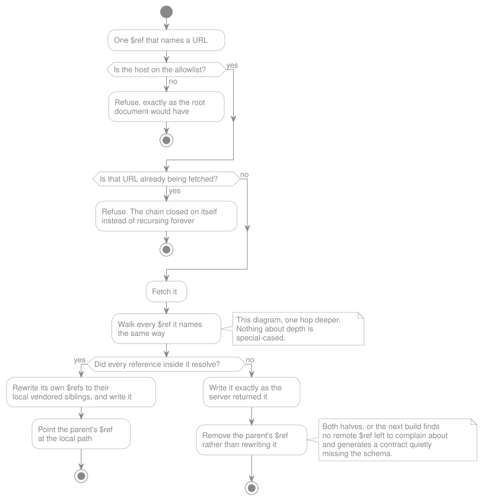

# Remote References

> **In brief**
>
> - A `$ref` pointing at a URL is refused unless you named its host in the allowlist, which ships empty.
> - `spec:build --update-refs` fetches an allowed reference once and commits the copy. Every later build reads that
>   copy, never the network.
> - Those copies are committed and there is no lock file, because git is the lock.
> - A fetched document that names a reference of its own is fetched too, and the allowlist is checked again at every
>   hop.

Every other input to the build sits in the repository. A `$ref` pointing at a URL does not, and this document owns what
the package does about that difference.

> **Mostly intent, marked per section.** Items marked `Open` are undecided.
>
> **Shipped:** the setting and everything it means. `lara-spec-first.remote_references.allowed_hosts` defaults to empty,
> and every remote reference is refused before the parser can fetch it — an empty allowlist still means no remote
> references at all. Naming a host now does what the setting always promised: `spec:build --update-refs` fetches it
> once, commits the copy under `remote_references.vendor_path`, and every build after that — with or without the flag —
> resolves the reference against that committed copy. A missing copy is a build error naming the flag to run, never an
> implicit fetch. See [the mechanism](#how-a-vendored-copy-stays-invisible-to-the-parser) for how this holds without
> touching `cebe\openapi\` at all.

**Decision: remote `$ref` targets are resolved only from an explicitly allowlisted set of domains, configured by the
consuming application.**

An OpenAPI document that can pull `$ref: https://example.com/schemas/user.yaml` turns a config file into a network
client running with the application's credentials and network position. Two problems, not one:

- **Security.** An untrusted or compromised spec reaches whatever the application server can reach — internal services,
  cloud metadata endpoints. The spec file is usually reviewed like documentation, not like code that makes outbound
  requests.
- **Availability.** A remote host that is slow or down becomes a boot failure for an application that has nothing to do
  with it.

An allowlist is the right shape because it is flexible where teams genuinely need it — an internal schema registry, a
shared contract repository — and closed everywhere else. Rules:

- **Empty by default.** No allowlist means no remote references. Local files keep working; a project that never uses
  remote `$ref` never sees this feature.

### The setting

|         |                                                                             |
| ------- | --------------------------------------------------------------------------- |
| File    | `config/lara-spec-first.php`, published with `--tag=lara-spec-first-config` |
| Key     | `remote_references.allowed_hosts`                                           |
| Default | `[]` — no host, therefore no remote reference                               |

A second key sits beside it:

|         |                                                                                        |
| ------- | -------------------------------------------------------------------------------------- |
| Key     | `remote_references.vendor_path`                                                        |
| Default | `openapi-external-refs` — a directory at the project root, committed, never gitignored |

**The package's defaults are merged _deeply_ underneath whatever an application published**, by
[`ConfigurationMerger`](https://github.com/Gcob/lara-spec-first/blob/main/src/Configuration/ConfigurationMerger.php)
rather than by Laravel's helper. Laravel's own `mergeConfigFrom()` merges one level, which is right for a flat file and
wrong for a nested one: an application that publishes this file and edits a single nested value replaces the whole
sub-array, so every key added to that section in a later release arrives missing — a published config that rots a little
with each upgrade, silently. Lists are the exception and are replaced wholesale, because merging `allowed_hosts` element
by element would make a host impossible to remove, which is the opposite of what a setting named after trust should do.

When there is more than one setting to describe, this belongs in a document of its own rather than under whichever
feature happened to need the first one.

Rules:

- **A disallowed reference is an error, never a skip.** A silently unresolved `$ref` is an unhonored contract, which
  rule 2 forbids. `RemoteReferenceException` names the offending reference and says vendoring it is the way in.
- **A missing vendored copy is an error naming the flag, never an implicit fetch.** `MissingVendoredReferenceException`
  names the reference, the vendored path it expected, and `php artisan spec:build --update-refs`. "Unresolvable
  reference" is a support ticket; that triple is a fix.
- **Matching is on the host, exactly, case-insensitively.** No wildcard subdomains, no partial matches —
  `evil-example.com` must never satisfy an entry for `example.com`. Case is not part of the scope this rule protects —
  DNS does not see one — so `Schemas.Example.COM` and `schemas.example.com` are one host, matched and vendored to one
  directory either way. Checked again at every hop a vendored document itself references — see
  [transitive fetching](#a-vendored-document-can-itself-name-a-reference) below.
- **A redirect is refused, never followed.** The allowlist checks the host written in the document; a client that
  follows a `3xx` response fetches whatever it names instead, which is the one thing this feature cannot let happen
  silently. `spec:build --update-refs` disables redirects entirely and reports one naming the `Location` it pointed at —
  a reference that moved is a reference to rewrite in the document, not one to follow through automatically.

**Status: shipped.** `remote_references.allowed_hosts` and `remote_references.vendor_path` are both live, and
`spec:build --update-refs` is the one command that reaches the network.

## A remote reference is a dependency, not a cache entry

Repeated network calls for the same reference are waste, so something has to hold the fetched document. The word for
that something is **not cache**, and the word is the design.

A cache is expendable by definition. You may clear it at any time, it may expire on its own, and nothing about your
application changes when it does — that is the contract of the word. None of that is true here. A remote `$ref` supplies
part of your API contract: drop it and your application can no longer describe, route, or validate what it serves. **A
remote reference is a dependency**, in the full sense the word carries in this ecosystem, and it should be handled the
way dependencies are handled: a vendored copy under version control, and an explicit act to change it.

Two things follow immediately, and each kills a config option that looked reasonable:

- **No duration.** A TTL means the contract can change at a moment nobody chose. Some Tuesday at 14:03 an entry expires,
  the upstream document has moved on, and the application serves a different contract than it did a minute earlier — no
  deploy, no commit, no review. **A contract changes when someone ships a change, not when a timer fires.** A source of
  truth that varies with wall-clock time is not a source of truth. No dependency manager resolves your dependencies
  again because an hour passed, and neither does this.
- **No cache store.** Routes are registered while the framework boots, so whatever the registration reads has to be
  available before the container is warm. Depending on Redis to know which routes exist is a boot-time network
  dependency in the request path, for data that never changes between deploys — and a shared store lets two servers in
  the same release disagree about the contract, which is precisely the failure a spec exists to prevent.

### No lock file: git is the lock

The dependency analogy suggests a lock file. It should not be taken, and working out why sharpens the whole design.

A lock file exists to pin something mutable to something exact — a version range to a resolved version, a resolved
version to a content hash. **Here there is no version to pin**: a `$ref` is a URL, and the only thing that could be
recorded is a hash of bytes we are already about to store on disk. So the lock would restate, less usefully, what the
vendored copy already is.

Less usefully, because of the review argument. A lock file diff says _a hash changed_. A vendored document diff says
_this response gained a required field_. For an API contract, the second is the entire value, and only committed copies
produce it. Git already content-addresses every file, so the integrity check the lock was there to provide is a property
of the repository, not something to reimplement.

**Decision: the vendored copies are committed, and there is no lock file.** Two consequences to design around:

- **The local path must encode where the document came from**, since nothing else records provenance. A layout mirroring
  host and path — one directory per host, the URL's path beneath it — is self-documenting, greppable, and reviewable.
  Fetching from the same URL twice must land in the same place, or the whole scheme leaks.
- **Detecting local tampering requires a refetch.** Without a recorded hash, a hand-edited vendored copy is caught by
  code review rather than by the tool. That is an honest trade, not an oversight: the edit does show up in a diff, and
  re-fetching is what the update path does anyway.

A query string is folded into the filename via a short stable hash rather than supported literally — a narrow answer,
not a general one. **Still open:** very long paths and case-insensitive filesystems both complicate a path-mirroring
layout further than this iteration solves.

### Borrowing the dependency-manager shape

The parts of the pattern worth taking, and only these:

| Piece                            | What it does here                                                                                                                                                                                                                                                                                                                                                |
| -------------------------------- | ---------------------------------------------------------------------------------------------------------------------------------------------------------------------------------------------------------------------------------------------------------------------------------------------------------------------------------------------------------------- |
| **Vendored copies, committed**   | The fetched documents, on disk, in version control. Once they exist, boot resolves everything locally and **the runtime never touches the network** — not on a miss, not on the first request after a restart, never, because there is no lookup to miss. Their diffs are how a change to your API contract shows up in a pull request instead of in production. |
| **Frozen by default**            | The build never reaches the network on its own. A fresh clone builds offline; a missing vendored copy is an error naming the flag to run, never an implicit fetch.                                                                                                                                                                                               |
| **Fetching is one explicit act** | Adding a reference and refreshing one are both deliberate, flagged operations, because both can change your contract. See [the build](./code-generation/index.md#remote-references-during-a-build-frozen-by-default).                                                                                                                                            |
| **Integrity by repository**      | Upstream changed under you? The refetch produces a diff, in a commit, in a review. A remote `$ref` is third-party content that shapes your public API surface, and treating it as untrusted input is the lesson every package ecosystem learned the expensive way — git gives us that property without a mechanism of our own.                                   |

The [allowlist](#the-setting) still governs every fetch, but its threat model shrinks to almost nothing: outbound
requests now happen only inside an explicit, human- or CI-triggered operation, never in a request.

### Where the analogy stops

We are not building a dependency manager, and the borrowed vocabulary must not drag in the rest of it:

- **No version constraints, no resolution, no solver.** A `$ref` is a URL, not a package with a version range. There is
  nothing to negotiate and no conflicts to resolve.
- **No registry, and nothing to publish.**
- **No lock file** — [git already is one](#no-lock-file-git-is-the-lock).
- **One divergence, deliberate: the vendored copies are committed.** Composer can leave `vendor/` out of version control
  because Packagist guarantees a published version is immutable. Nothing guarantees that about
  `https://example.com/schemas/user.yaml` — it can change or vanish tomorrow. Committing the copies is what makes an old
  release still deployable, and it is why no lock file is needed.

**Decided:** the vendored directory is named by `remote_references.vendor_path`, and the refetch flag is
`spec:build --update-refs` — one flag for both adding a missing reference and refreshing one already vendored, rather
than two. Both are public API surface under [rule 4](./openapi-support.md#the-four-rules).

### A vendored document can itself name a reference

**Decided: followed, not refused at depth one.** A document `spec:build --update-refs` just fetched is walked the same
way the root specification is — every `$ref` it names is checked against the allowlist and vendored in turn, so a schema
registry that splits its documents across several files works exactly as it would if none of them were remote.

_One reference, walked._ The recursion is the diagram calling itself.

The two endings are the part worth the second look: the same walk either points the parent at a local path, or leaves
upstream's bytes on disk and takes the parent's reference away.

The allowlist applies again at every hop: a vendored document naming a host nobody allowed refuses exactly like the root
document would, and a chain of references that closes back on a URL already being fetched raises rather than recursing
forever. Nothing about depth is special-cased — the same check, run again, is what "at every hop" means.

One consequence worth naming: the committed copy of a document that itself named a remote reference is not byte-for-byte
what the server returned. Its own `$ref` values are rewritten to point at their local vendored siblings before it is
written to disk, for the same reason the top-level reference is rewritten — see below. What a reviewer reads in that
diff is still upstream's content; only a URL that would otherwise reach the network again on every rebuild becomes a
path that already has.

**And only when every reference in it could be resolved.** A vendored copy the walk refused something in is left on disk
exactly as it was fetched, and the reference pointing into it is removed from the document that named it rather than
rewritten to a local path. Both halves matter and neither works alone:

- **Not rewritten**, because the walk has already removed the offending `$ref` from the in-memory copy, and writing that
  back would erase the evidence of the fault from the file the next read starts from. The realistic case is a fresh
  clone where a transitive vendored copy was never committed: the first build says to run `--update-refs`, and if the
  parent file had been rewritten in the meantime, a second plain build would find no remote `$ref` left to complain
  about, exit successfully, and generate a contract quietly missing the schema that reference pointed at. So: a build
  that fails writes nothing, and building twice on unchanged inputs reports the same faults twice.
- **Not linked to**, because keeping the original bytes means that file still names a URL — and the parser resolves a
  _local_ `$ref` by opening the file itself, so a parent rewritten to point at it would hand `cebe\openapi\` the very
  reference the walk refused, one hop later.

A file `--update-refs` fetched on the way there does stay on disk. That is upstream's own bytes, exactly what the flag
was asked to vendor, and the next build walks it again and reports the same fault from it.

### How a vendored copy stays invisible to the parser

Nothing above would work if `cebe\openapi\` — the OpenAPI parser this package wraps — ever saw a `$ref` naming a URL,
because it resolves one by calling `file_get_contents()` on it directly. Two properties of how the parser is already
used are what make rewriting the reference enough, with no change to the parser or to how it is called:

- **The parser is handed the array this package already decoded, never asked to re-read the file.**
  `OperationExtractor::parse()` builds its object model from `$document->raw` — the same array `SpecDocumentReader`'s
  five-step pipeline produced — rather than reopening the specification from disk. So a `$ref` rewritten during step 5
  is exactly what the parser receives; there is no second read of the original bytes for a rewrite to lose a race
  against.
- **A relative reference is resolved against the document that names it, recursively.** `ReferenceContext` resolves each
  `$ref` relative to the file its containing document was read from, and when the parser follows a reference into
  another file, it resolves that file's own references the same way, relative to _that_ file. This is not new behaviour
  added for vendoring — it is what already lets a specification split across several local files work today.

Put together: once every `$ref` naming a URL has been rewritten to a path relative to the document that names it — the
root specification, or a vendored file that named another vendored file — the result is indistinguishable from an
ordinary local, multi-file specification. The parser was never taught about vendoring; it simply never encounters
anything to fetch.

### Vendoring is one part of the build

Vendoring makes the _inputs_ local. Turning those inputs into routes, controllers and validation is a separate job, and
both belong to the same command — see [`code-generation/index.md`](./code-generation/index.md). Do not conflate the two:
vendoring alone already guarantees no network at boot, whatever the build does afterwards.

What is settled here regardless: **the doctor reads, it never writes** — it is
[read-only by contract](./doctor.md#the-contract) — and its report names which sources it read, because a doctor that
silently checks something other than what runs is worse than no doctor.
